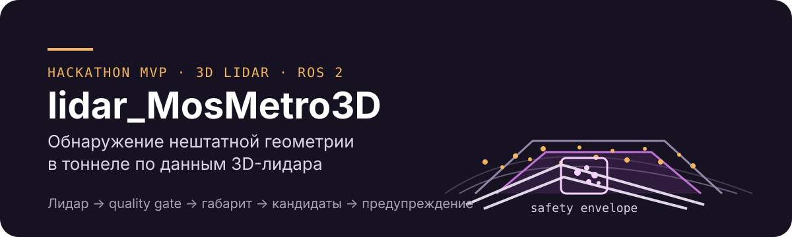

<p align="center">
  
</p>

# lidar_MosMetro3D

Экспериментальный модуль обнаружения препятствий в габарите движения поезда метро по облакам 3D-лидара. Текущее решение ищет рельсы, строит габарит с продолжением `tangent` и применяет обученную `candidate_baseline_v2` к компонентам внутри него: «препятствие / шум».

Два способа запуска используют общее C++ ядро:

| Задача | Вход и выход | Нужен ли плеер |
|---|---|---|
| Исследование записей | Архив bag → XYZ → прямой C++ → JSON → HTTP-плеер | Да, для просмотра |
| Проверка заказчиком / сдача | ROS2 PointCloud2 → C++ node → ROS2 String с JSON | Нет |

Интеграционные проверки сохранены в [отчёте direct player](docs/stages/stage_5/stage_5_direct_player_run.md). Это ограниченные проверки интерфейсов, не доказательство качества на новых объектах. `UNKNOWN` и отрицательный ответ модели не означают свободный путь.

Среда сдачи по [ТЗ](docs/hackathon_documentations/5.%20ДепТранспорта.pdf): **Ubuntu 22.04 + ROS 2 Humble + Docker**. Проект подготовлен для [«Лидеров цифровой трансформации»](https://i.moscow/cabinet/hackaton/lct/contest/1233bb5506bc455f86d534b3b40171f1).

## Как работает текущий алгоритм

```text
PointCloud2 / XYZ
  → проверка входа → поиск наблюдаемых пар рельсов
  → ось и габарит с synthetic tangent-продолжением
  → raw CORE → связные компоненты → candidate_baseline_v2: препятствие / шум
  → кандидат, ближайшее расстояние и диагностика
```

Выбор пар — `development_candidate`; диапазон поиска — 2–80 м. Синтетическое продолжение габарита отличается от наблюдаемой рельсовой опоры и отмечается в результате. 80 м — параметр, а не измеренная дальность обнаружения. Модель — forest-lite классификатор, встроенный в C++; [метод и ограничения](docs/README_noise_classifier.md).

## Где должны лежать данные

Данные не входят в Git и Docker image. Команды запуска ничего не скачивают.

Для **C++ CPU player/catalog** нужны три **TAR-файла без расширения** в каталоге
`dataset/for_hackathon/`:

```text
dataset/for_hackathon/for_hackathon          # шесть исходных сцен
dataset/for_hackathon/new_data               # новый длинный проезд
dataset/for_hackathon/cloud_with_fake_obj    # fake obstacle dataset
```

Если TAR-файлы уже лежат в `dataset/raw/`, не копируйте десятки гигабайт:
создайте hardlink-и из PowerShell в корне проекта:

```powershell
New-Item -ItemType Directory -Force dataset\for_hackathon | Out-Null
New-Item -ItemType HardLink -Path dataset\for_hackathon\for_hackathon -Target dataset\raw\for_hackathon
New-Item -ItemType HardLink -Path dataset\for_hackathon\new_data -Target dataset\raw\new_data
New-Item -ItemType HardLink -Path dataset\for_hackathon\cloud_with_fake_obj -Target dataset\raw\cloud_with_fake_obj
```

Проверка:

```powershell
Get-Item dataset\for_hackathon\for_hackathon, `
         dataset\for_hackathon\new_data, `
         dataset\for_hackathon\cloud_with_fake_obj
```

Также нужны локальные viewer-assets и XML, которые launcher проверяет до сборки.
**`-RebuildImage` собирает образ, но не создаёт данные, viewer-assets или XML.**
[Однократная подготовка](docs/README_player_setup.md) описывает их получение.

Для **нового датасета заказчика** используйте ROS2-вход ниже, а не CPU catalog:
catalog сейчас перечисляет известные источники из `dataset/for_hackathon`.
Заказчик должен предоставить распакованный ROS2 bag-каталог с `metadata.yaml`
и `.db3`-файлами. Путь к нему подставляется в `$bagPath`; `input_topic` и
`source_frame` берутся из `ros2 bag info` и `header.frame_id` PointCloud2.

## C++ CPU player: прямой запуск алгоритма

Текущий режим плеера: `development_candidate`, `RailForwardMinM=2`, `tangent`, `candidate_baseline_v2`.

```text
Кадр из bag → XYZ → постоянный C++-процесс через stdin
  → поиск рельсов → габарит tangent → компоненты CORE
  → candidate_baseline_v2: препятствие / шум → JSON через stdout → плеер
```

Плеер использует `DirectDetailedCpuRuntime`: каждый запрошенный кадр передаётся C++ один раз. В этом режиме не запускаются ROS2-узлы, DDS и цикл повторной публикации PointCloud2. Библиотеки ROS остаются в образе для чтения bag/десериализации сообщений. Первое открытие источника может занимать время из-за извлечения SQLite из архива.

При обновлении обученной модели этот прямой C++ путь сохраняется. ROS2 остаётся отдельным входом в общее ядро и не добавляется в обработку кадров плеера. После обучения скорость новой модели сравнивается с текущей на одинаковом прямом пути; общность ядра сама по себе не гарантирует одинаковое время разных моделей.

При запущенном Docker Desktop из корня репозитория, после [подготовки архивов и файлов плеера](docs/README_player_setup.md):

```powershell
docker ps -q --filter "publish=8100" | ForEach-Object { docker stop $_ }
.\scripts\run_stage_2_cpu_player.ps1 `
  -Port 8100 `
  -RailSelectionMethod development_candidate `
  -RailForwardMinM 2 `
  -ForwardExtensionMethod tangent `
  -NoiseFilterMode candidate_baseline_v2 `
  -RebuildImage
```

Откройте [http://localhost:8100/](http://localhost:8100/), выберите датасет и нажмите **▶ Запуск**. Плеер получает облако и соответствующий JSON от C++; в режиме `candidate_baseline_v2` использует готовые индексы препятствия/шума и геометрию. `CORE` до модели может содержать инфраструктуру; отрицательный результат модели и `UNKNOWN` не означают подтверждённый свободный путь.

Для визуальной проверки лучшей offline-модели из
[README_noise_classifier_v2.md](docs/README_noise_classifier_v2.md)
используется отдельный образ `stage-4-cpu-viewer-v2-best`. Он не заменяет
обычную runtime-модель в `models/`, а встраивает v2-best JSON только в этот
viewer-образ:

```powershell
docker ps -q --filter "publish=8100" | ForEach-Object { docker stop $_ }
.\scripts\run_stage_2_cpu_player.ps1 `
  -Port 8100 `
  -RailForwardMinM 2 `
  -ForwardExtensionMethod tangent `
  -NoiseFilterMode candidate_baseline_v2 `
  -Image lidar-mosmetro3d:stage-4-cpu-viewer-v2-best `
  -Dockerfile Dockerfile.v2-best-cpu-viewer `
  -RebuildImage
```

После пересборки откройте
[http://localhost:8100/?dataset=doubleT_obstacle&v=generic-backend-filter-1](http://localhost:8100/?dataset=doubleT_obstacle&v=generic-backend-filter-1)
и сделайте `Ctrl+F5`, если страница уже была открыта.

Проверить выбранный режим и один результат:

```powershell
$manifest = Invoke-RestMethod 'http://localhost:8100/api/cpu_sources/doubleT_obstacle/manifest.json'
$manifest | Select-Object runtime_transport, noise_filter_mode, rail_selection_method, rail_search_config, forward_extension_config
$frame = Invoke-RestMethod 'http://localhost:8100/api/cpu_sources/doubleT_obstacle/13.json' -TimeoutSec 60
$frame.result | Select-Object intrusion_candidate_present, reportable_core_count, nearest_reportable_intrusion_distance_from_source_origin_m, status, system_status, safety_decision_permitted
```

Ожидаются `direct_cpp`, `candidate_baseline_v2`, `development_candidate`, начало поиска `2`, метод `tangent`. Для development-кадра 13 ожидается кандидат; `system_status=UNKNOWN` и `safety_decision_permitted=false` сохраняются. Холодное чтение SQLite может увеличить ожидание; тайм-аут HTTP-клиента не останавливает обработку на сервере.

Отдельная проверка совпадения прямого плеера с ROS2-входом:

```powershell
.\scripts\validate_ros_model_pipeline.ps1 -Port 8100
```

В manifest и JSON плеера должны быть `runtime_transport=direct_cpp`, `noise_filter_mode=candidate_baseline_v2`. Контрольные development-кадры `doubleT_obstacle`: 13 — кандидат препятствия, 145 — шум. Валидатор отдельно запускает ROS2 в тестовом контейнере; самому плееру ROS2-транспорт не нужен. Для проверки нужны сохранённые XYZF и extracted bag `doubleT_obstacle`; это проверка интеграции, не независимого качества модели.

Исторический явный `-RailSelectionMethod baseline` сохраняет ROS2-путь. Опция `-Measure` также отдельно измеряет ROS2-обработку окна; её результаты не являются задержками прямого плеера.

Остановить плеер:

```powershell
docker ps -q --filter "publish=8100" | ForEach-Object { docker stop $_ }
```

## ROS2-вход для сдачи и потоковой демонстрации

По ТЗ §3.3 решение должно подключаться к ROS2, а §4 и §8.6 предусматривают демонстрацию через `ros2 bag play`. Это не требует ROS2-транспорта внутри плеера. Для сдачи сохранён отдельный `curve_envelope_node`:

```text
ros2 bag play → PointCloud2 → C++ ROS2-узел
  → те же AutoRails / tangent / компоненты / candidate_baseline_v2
  → ROS2-результат (std_msgs/String с JSON)
```

Оба входа используют общее C++-ядро и существующую обученную модель `ApplyCandidateBaselineV2`. ROS2-узел вызывает алгоритм внутри своего процесса; запуск плеера не требуется. Входной топик и `source_frame` задаются параметрами под bag, выходной топик по умолчанию — `/stage_3/curve_envelope_candidate`. Основные параметры совпадают с плеером: `rail_selection_method=development_candidate`, `rail_forward_min_m=2.0`, `forward_extension_method=tangent`, `noise_filter_mode=candidate_baseline_v2`.

Текущее разделение заменяет промежуточную интеграцию, при которой каждый кадр плеера передавался через DDS. [Спецификация](docs/stages/stage_5/stage_5_direct_player.md) и [результаты проверки](docs/stages/stage_5/stage_5_direct_player_run.md).

### Пошаговый запуск без плеера

Команды ниже выполняются в **PowerShell из корня проекта** при работающем Docker Desktop. Пример использует уже распакованный `dataset/extracted/doubleT_obstacle`: каталог должен содержать `metadata.yaml` и `.db3`. Заказчик может подставить абсолютный путь к своему распакованному bag в `$bagPath`.

Для нового датасета заказчика сначала задайте путь и посмотрите доступные
топики:

```powershell
$bagPath = 'D:\customer_data\some_ros2_bag'
docker run --rm --mount "type=bind,source=$bagPath,target=/data,readonly" `
  lidar-mosmetro3d:stage-4-cpu-viewer /ros_entrypoint.sh ros2 bag info /data
```

В командах ниже замените:

- `$bagPath` — на путь к распакованному bag заказчика;
- `input_topic` — на PointCloud2-топик из `ros2 bag info`;
- `source_frame` — на реальный `header.frame_id` PointCloud2. Если frame
  неизвестен, сначала просмотрите одно сообщение через `ros2 topic echo`;
  подстановка имени топика вместо frame не является калибровкой.

**1. Собрать образ и запустить детектор в фоне:**

```powershell
docker build -t lidar-mosmetro3d:stage-4-cpu-viewer .
$bagPath = (Resolve-Path 'dataset/extracted/doubleT_obstacle').Path

docker run --rm -d --name lidar-detector --shm-size=1g `
  -e ROS_DOMAIN_ID=172 -e ROS_LOCALHOST_ONLY=1 `
  --mount "type=bind,source=$bagPath,target=/data,readonly" `
  lidar-mosmetro3d:stage-4-cpu-viewer `
  ros2 run lidar_mosmetro3d_cpp curve_envelope_node --ros-args `
  -p input_topic:=/sensing/lidar/hesai128/pointcloud `
  -p source_frame:=lidar_livox `
  -p output_topic:=/stage_3/curve_envelope_candidate `
  -p compute_backend:=cpu `
  -p rail_selection_method:=development_candidate `
  -p rail_forward_min_m:=2.0 `
  -p forward_extension_method:=tangent `
  -p noise_filter_mode:=candidate_baseline_v2
```

Несмотря на имя образа, HTTP-сервер и плеер этой командой не запускаются. Детектор, bag player и просмотр результата работают в одном контейнере. Для больших облаков используется SHM-профиль образа; 1 GiB shared memory оставляет место для детектора, bag player, `topic echo` и ROS2 daemon. При 512 MiB в этом сценарии наблюдалась ошибка создания SHM-сегмента.

**2. В отдельном окне PowerShell начать чтение результата:**

```powershell
docker exec -it lidar-detector /ros_entrypoint.sh `
  ros2 topic echo /stage_3/curve_envelope_candidate std_msgs/msg/String --field data
```

**3. В третьем окне проиграть bag:**

```powershell
docker exec -it lidar-detector /ros_entrypoint.sh ros2 bag info /data
docker exec -it lidar-detector /ros_entrypoint.sh ros2 bag play /data --rate 1.0 --read-ahead-queue-size 2
```

`/ros_entrypoint.sh` подготавливает окружение ROS для каждой команды `docker exec`. `--read-ahead-queue-size 2` ограничивает предварительное чтение двумя сообщениями: полные облака этого bag велики, большой буфер требует много RAM и увеличивает ожидание старта. Это буфер чтения bag, не очередь детектора. Для просмотра в замедленном темпе можно поставить `--rate 0.2`; это не проверка производительности при исходной частоте. После конца bag можно повторить `ros2 bag play`, не перезапуская детектор.

При проверке этого сценария на Windows/Docker получен JSON детектора; также наблюдалось предупреждение `Message queue starved` при чтении большого bag с bind mount. Оно означает задержки подачи сообщений: для такого запуска исходный темп не гарантирован. Для оценки производительности на стенде отдельно измеряются чтение, обработка и число полученных результатов.

В окне результата появляются JSON-сообщения: `intrusion_candidate_present`, `nearest_reportable_intrusion_distance_from_source_origin_m`, `status`, `reason`, `source_frame`, `header_timestamp_ns`. `runtime_transport=ros2` и `noise_filter_mode=candidate_baseline_v2` подтверждают выбранный путь. Расстояние отсчитывается от начала координат исходного облака; отсутствие поддержанного результата даёт `UNKNOWN`/`null`, а не доказательство свободного пути. `system_status=UNKNOWN` и `safety_decision_permitted=false` сохраняют статус экспериментального candidate-only решения.

Для другого bag нужно согласовать `input_topic` с `ros2 bag info`, а `source_frame` — с реальным `header.frame_id` PointCloud2. В примере `doubleT_obstacle` топик содержит `hesai128`, но frame равен **`lidar_livox`**; имя топика не определяет систему координат. Подстановка frame сама по себе не подтверждает калибровку или геометрию нового источника.

**4. Остановить детектор:**

```powershell
docker stop lidar-detector
```

На стенде Ubuntu те же команды `docker` выполняются из Bash: для пути используйте `bagPath="$(realpath dataset/extracted/doubleT_obstacle)"`, `$bagPath` в mount и обратную косую черту `\` вместо PowerShell-backtick для переноса строк. Внутренние команды ROS2 остаются теми же. Для автоматической проверки можно подписаться на выходной топик или записать его через `ros2 bag record`; браузер не требуется.

## Результат и ограничения

| Поле / слой | Смысл |
|---|---|
| Raw CORE | Все наблюдаемые точки внутри текущего габарита до модели |
| Reportable / `intrusion_candidate_present` | Компоненты, которые `candidate_baseline_v2` поднимает как сигнал; одиночная CORE-точка не обязательно даёт сигнал |
| Ignored noise | Компоненты, подавленные моделью; raw CORE остаётся доступен |
| `nearest_reportable_intrusion_distance_from_source_origin_m` | Расстояние до ближайшей reportable точки от начала координат исходного облака, не от носа поезда |
| `system_status=UNKNOWN`, `safety_decision_permitted=false` | Геометрия assumed, разрешение движения не выдаётся; отсутствие кандидата не CLEAR |

Калибровка монтажа, физический динамический габарит и качество на независимых положительных проездах не подтверждены. Положительный интервал разработки — `doubleT_obstacle` **13–64 включительно**, один известный объект; 52 кадра не являются 52 независимыми событиями. Frame metrics, event metrics и UNKNOWN coverage учитываются отдельно.

В текущий запуск не входят CUDA, arc-варианты, deskew, карта, tracking и TTC. `arc_limited` остаётся явным экспериментальным player-режимом; `arc_clamped` доступен только в низкоуровневых C++/ROS2 экспериментах. Их наличие не меняет выбранный `tangent`. Качество и скорость оцениваются раздельно; [результаты измерений](docs/README_noise_classifier.md#время-и-соответствие-тз) указывают версию и область замера. Прямой транспорт не исключает ожидание чтения архива, lock или C++ обработки.

Это хакатонный прототип, не сертифицированная система управления торможением. В разработке находятся генератор синтетических препятствий и фильтр ложных срабатываний; затем планируется обучение на синтетике и, при необходимости, сравнение ML-моделей. Проверки финальной версии, фиксация результатов и видео выполняются после выбранной доработки. [План работ и задачи перед сдачей](docs/README_work_plan.md).

## Среда разработки

- Dockerfile использует `ros:humble-ros-base-jammy`; системные Python/ROS-зависимости устанавливаются APT, C++ пакет собирается colcon.
- [`.python-version`](.python-version) содержит `3.10`. Локальная Windows `.venv` — отдельная среда; на этой машине её конфигурация указывает Python 3.12.10. Смена локального Python не требуется для запуска контейнера.
- [`requirements.txt`](requirements.txt) перечисляет NumPy и Matplotlib; ROS2/rclpy/messages поставляются образом, а исследовательские scripts могут требовать дополнительные системные или локальные зависимости. Этот файл не является полным установщиком ROS-окружения.
- CPU — основной путь. Сведения о [GPU стенде организатора](docs/stages/stage_3/stage_3_organizer_gpu_environment_run.md) не заменяют проверку GPU Docker runtime или замер на самом стенде.

## Документация

- [Быстрый запуск плеера для проверяющих](docs/README_REVIEWER_PLAYER_QUICKSTART.md).
- [Чеклист сдачи и repo-gate](docs/README_SUBMISSION_CHECKLIST.md).
- [Методология и действующий контракт](docs/README_methodology.md).
- [Модель шума, разметка и результаты экспериментов](docs/README_noise_classifier.md).
- [План работ и текущие статусы](docs/README_work_plan.md).
- [Описание двух архивов](docs/README_dataset_describtion.md), [реестр наблюдений и границы выборок](docs/README_dataset_audit.md).
- [Габарит и необходимые калибровки](docs/README_train_clearance.md), [паспорт лидара](docs/README_LiDAR_Specifications.md).
- [История, экспериментальные режимы и восстановление старых артефактов](docs/README_history.md).
- [Правила проекта](AGENTS.md), [маршрутизатор контекста](agents/context_router.md).

## Структура репозитория

```text
src/          C++ ядро, ROS2 пакет, Python readers и исследовательские модули
scripts/      запуск, экспорт, replay, обучение и оценка
config/       контракты, параметры и development-аннотации
models/       версионированный JSON `candidate_baseline_v2`; runtime использует C++ реализацию
web/          HTTP-плеер и прежние исследовательские интерфейсы
dataset/      локальные архивы/распаковки, ignored
artefacts/    локальные результаты и assets, ignored
docs/
  README_methodology.md
  README_work_plan.md
  README_dataset_audit.md
  stages/     спецификации и отчёты stage_N/stage_N_<purpose>.md
  reports/    датированные аудиты по категориям
  tasks/      исторические task specs
agents/       роли и проверочные чек-листы
```

## Лицензия

[MIT](LICENSE).
