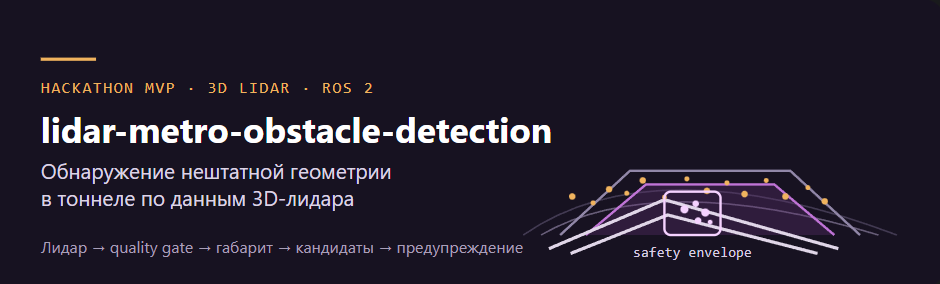

<p align="center">
  
</p>

# lidar-metro-obstacle-detection

Демонстрационный прототип обнаружения препятствий в тоннеле метро по облакам 3D-лидара.

[](https://ikonushok.github.io/lidar-metro-obstacle-detection/diagrams/runtime-architecture.html)

[**Открыть интерактивную схему архитектуры →**](https://ikonushok.github.io/lidar-metro-obstacle-detection/diagrams/runtime-architecture.html) Масштабирование, темы и просмотр связей между компонентами. Схема показывает оба способа запуска и общую C++ реализацию.

Текущий алгоритм — `baseline_v3`: C++ ядро с браузерным плеером для записей и отдельным ROS2-входом для `PointCloud2`.

Конвейер обработки:

```text
облако точек → проверка входа → поиск рельсов → габарит движения
             → geometry-first / boundary / temporal model-assist
             → кандидат препятствия, расстояние и diagnostics
```

## Проверка на данных проверяющего

Основной путь для новых данных: `ros2 bag play → PointCloud2 → curve_envelope_node → JSON`. Проверяющий предоставляет **папку с записью лидара**: внутри должны быть `metadata.yaml` и файлы `.db3`. В ROS2 такая запись называется bag. Узнайте PointCloud2-топик через `ros2 bag info`, а `source_frame` — из `header.frame_id` сообщения. Имя топика не определяет frame.

На Windows с Docker Desktop запустите детектор из корня проекта, указав путь к папке с записью и параметры облака точек:

```powershell
.\scripts\run_submission_ros2_demo.ps1 `
  -RecordingPath 'D:\data\lidar_run_01' `
  -InputTopic '/your/pointcloud' `
  -SourceFrame 'your_lidar_frame' `
  -BuildImage -StopExisting
```

Скрипт печатает команды для просмотра JSON и воспроизведения записи. Выходной топик — `/stage_3/curve_envelope_candidate`; в JSON проверяйте `intrusion_candidate_present`, ближайшее расстояние, `status` и `reason`. Подробный сценарий с командами ROS2 и вариант для Ubuntu: [SOLUTION.md](SOLUTION.md#74-запустить-headless-ros2-replay).

## Плеер с архивами организаторов

Для просмотра известных записей в браузере нужен работающий Docker с Compose. Положите три архива в `dataset/raw/`: `for_hackathon`, `new_data`, `cloud_with_fake_obj`. Данные не входят в Git и не скачиваются автоматически; допустимые расширения описаны в [инструкции подготовки](docs/REVIEWER_QUICKSTART.md).

```bash
docker compose up --build
```

Команда собирает образ Ubuntu 22.04 / ROS 2 Humble, при необходимости подготавливает архивы и запускает direct C++ плеер с `baseline_v3`. Откройте [http://localhost:8100/](http://localhost:8100/). Для остановки выполните `docker compose down`. Плеер перечисляет известные источники; **для новой записи используйте ROS2-вход выше**.

**Цвета предупреждений в плеере:**

- **Оранжевое «Возможное препятствие на XX м»** — экспериментальный предварительный сигнал. C++ нашёл внутри габарита группу точек подходящей формы; плеер показывает надпись после трёх кадров подряд с таким кандидатом. Это не подтверждённая тревога: статус может оставаться `UNKNOWN`, а плеер не проверяет, что в трёх кадрах виден один и тот же объект.
- **Красное «Препятствие на XX м»** — основной C++ детектор выдал `intrusion_candidate_present=true`; плеер окрашивает его подтверждённые точки красным. Это решение алгоритма, а не гарантия реального препятствия. На `new_data`, где по сообщению пользователя препятствий нет, 47 кадров с красной тревогой считаются ложноположительными; плеер помечает их как «Ложная тревога».

## Результат и границы

- Выход: кандидат препятствия, ближайшее расстояние от начала координат исходного облака, статус и diagnostics.
- `UNKNOWN` и отсутствие кандидата **не означают свободный путь**. Решение не выдаёт разрешение движения.
- Монтаж лидара, физический габарит и качество на независимых положительных проездах не подтверждены. `80 м` — граница поиска, а не измеренная дальность обнаружения.
- Это хакатонный прототип, не сертифицированная система управления поездом. [Текущие проверки и пробелы](docs/reports/submission/SUBMISSION_READINESS_REPORT.md) приведены отдельно.

## Документация

**Запуск и решение**

- [SOLUTION.md](SOLUTION.md) — устройство решения, алгоритм, запуск и ограничения.
- [REVIEWER_QUICKSTART.md](docs/REVIEWER_QUICKSTART.md) — подготовка архивов, плеер, проверка API и ROS2-демо.
- [PLAYER_SETUP.md](docs/PLAYER_SETUP.md) — ручная подготовка файлов плеера для PowerShell launcher.

**Метод, данные и оценка**

- [METHODOLOGY.md](docs/METHODOLOGY.md) — действующий метод, контракты и границы будущих расширений.
- [DATASETS_AND_ASSUMPTIONS.md](docs/DATASETS_AND_ASSUMPTIONS.md) — состав данных, проверенные наблюдения и допущения.
- [TRAIN_ENVELOPE_AND_LIMITATIONS.md](docs/TRAIN_ENVELOPE_AND_LIMITATIONS.md) — габарит поезда и необходимые калибровки.
- [LIDAR_SPEC.md](docs/LIDAR_SPEC.md) — характеристики лидара и ограничения входных данных.
- [EVALUATION_METRICS.md](docs/EVALUATION_METRICS.md) — расчёт метрик `baseline_v3` и границы оценки.

**Сдача и результаты проверок**

- [SUBMISSION_CHECKLIST.md](docs/SUBMISSION_CHECKLIST.md) — состав передачи и проверки перед сдачей.
- [DEVELOPMENT_HISTORY_AND_STATUS.md](docs/DEVELOPMENT_HISTORY_AND_STATUS.md) — выполненные этапы, текущий статус и оставшиеся задачи.
- [SUBMISSION_READINESS_REPORT.md](docs/reports/submission/SUBMISSION_READINESS_REPORT.md) — подтверждённые результаты и пробелы к критериям сдачи.
- [ROS2_HEADLESS_DEMO_VERIFICATION.md](docs/reports/submission/ROS2_HEADLESS_DEMO_VERIFICATION.md) — журнал проверки ROS2-демо без браузера.
- [Техническое задание](docs/hackathon_documentations/5.%20ДепТранспорта.pdf) — требования заказчика к решению и среде запуска.
- [Инструкция по сдаче](docs/hackathon_documentations/instruction.md) — правила передачи материалов и стоп-кода.

[Иллюстрации для презентации](docs/presentation/picts/) хранятся отдельно от инструкций и отчётов.

Лицензия: [MIT](LICENSE).
