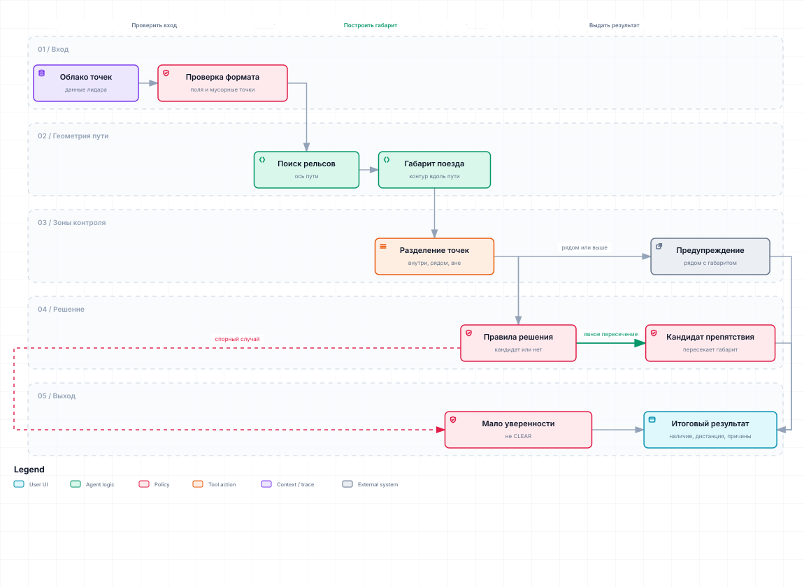
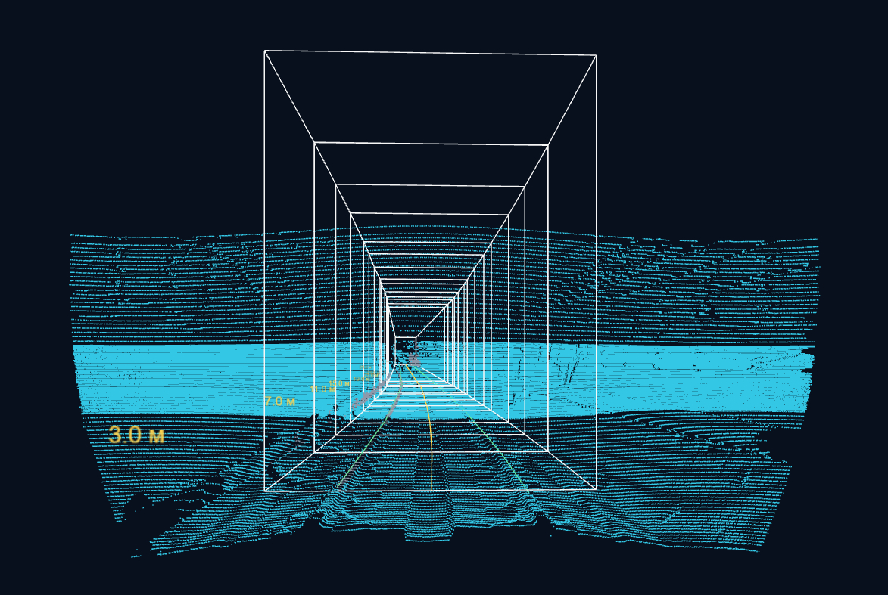

# Описание решения

Статус: срез для сдачи на 2026-09-27. Это хакатонный прототип для
обнаружения кандидатов препятствий в габарите движения поезда метро по данным
3D-лидара. Решение не является сертифицированной системой безопасности и не
выдаёт разрешение на движение поезда.

## 1. Кратко

Решение принимает облако точек `sensor_msgs/msg/PointCloud2`, строит локальную
ось рельсов, протягивает вдоль неё габарит поезда и ищет связные компоненты
точек внутри контролируемой зоны. Текущий финальный исполняемый путь —
`baseline_v3 runtime`: geometry-first gate, boundary/warning для объектов вне
или выше габарита и temporal model-assist только для слабых/неочевидных случаев.
Если temporal-ветка не подтверждает такой случай, результат остаётся `UNKNOWN`,
не `CLEAR`.

Внутренний score слабой ветки перенесён в `baseline_v3`; отдельной финальной
моделью он не является.

Основной выход:

- `intrusion_candidate_present` — найден ли reportable-кандидат препятствия;
- `nearest_reportable_intrusion_distance_from_source_origin_m` — расстояние до
  ближайшей reportable-точки от начала координат исходного облака;
- `status`, `system_status`, diagnostics — почему кандидат найден, подавлен
  или состояние осталось неопределённым;
- `safety_decision_permitted=false` — модуль не разрешает движение.

Важно: `UNKNOWN` и отсутствие reportable-кандидата не означают подтверждённый
`CLEAR`.

## 2. Что получает проверяющий

Репозиторий содержит:

- Docker-сборку на базе `ros:humble-ros-base-jammy`;
- C++ ядро обработки облака;
- ROS2 node `curve_envelope_node` для сценария `ros2 bag play`;
- direct HTTP-плеер для просмотра подготовленных датасетов;
- скрипты подготовки локальных датасетов из `dataset/raw`;
- документацию и gate-проверку состава репозитория для сдачи.

Данные не входят в Git и Docker image. Проверяющий кладёт архивы локально в
`dataset/raw`, затем запускает подготовительный скрипт.

## 3. Входные данные

Ожидаемый runtime-вход — запись ROS2 с сообщениями
`sensor_msgs/msg/PointCloud2`.

Поддерживаемые практические варианты:

- direct player/catalog: архивы в `dataset/for_hackathon`;
- headless ROS2: папка с распакованной записью в `dataset/extracted/<source>`.

Для player-сценария проверки используются три локальных архива без расширения:

```text
dataset/raw/for_hackathon
dataset/raw/new_data
dataset/raw/cloud_with_fake_obj
```

После подготовки они появляются как ignored-файлы/каталоги в
`dataset/for_hackathon` или `dataset/extracted`. Эти пути намеренно не
отслеживаются Git.

## 4. Архитектура

Оба режима запуска используют одно C++ ядро.



Актуальный runtime pipeline:

```text
PointCloud2 / XYZ
  -> rail axis + tangent train envelope
  -> geometry-first gate
  -> inside envelope: obstacle
  -> outside/above envelope: boundary warning, not obstacle
  -> weak/ambiguous case: temporal model-assist
  -> no temporal confirmation: UNKNOWN
```

Direct player:

```text
архив записи -> XYZ -> C++ stdin/stdout -> HTTP JSON -> web player
```

ROS2 path:

```text
ros2 bag play -> PointCloud2 -> curve_envelope_node -> std_msgs/String JSON
```

Входной топик и `source_frame` задаются параметрами. Имя топика не считается
доказательством системы координат: `source_frame` должен соответствовать
реальному `header.frame_id` сообщения.

## 5. Алгоритм

1. Декодируется фактическая схема `PointCloud2`: поля, offsets, datatype,
   endian, `point_step`, `row_step`.
2. Невалидные и нулевые XYZ-точки не используются как препятствия.
3. Из текущего облака выбираются наблюдаемые пары рельсов.
4. По ним строится локальная ось пути.
5. Вдоль оси протягивается контролируемый габарит.
6. Точки внутри CORE-зоны группируются в компоненты.
7. `baseline_v3` сначала принимает сильные геометрические intrusion-компоненты
   как препятствие.
8. Внешние/верхние компоненты переводятся в `boundary/warning`, а слабые или
   маленькие случаи проходят через temporal model-assist.
9. Для reportable-компонент вычисляется ближайшая дистанция и диагностический
   статус; неподтверждённые слабые случаи остаются `UNKNOWN`.

Текущий исполняемый runtime/smoke-режим:

```text
rail_selection_method = development_candidate
rail_forward_min_m    = 2.0
forward_extension     = tangent
noise_filter_mode     = baseline_v3
```

Параметр 80 м в конфигурации tangent-графа — это предел продолжения рабочей
геометрии, а не подтверждённая дальность обнаружения.

## 6. Визуальный пример

Видео обнаружения препятствий и работы плеера доступны [в папке на Google Drive](https://drive.google.com/drive/folders/1faIDjvqWk145uFcsPRrAioY53D9uxXmo?usp=sharing).

Кадры ниже взяты из локального player-сценария.





## 7. Как запустить

### 7.1. Подготовить данные

Положить исходные архивы в `dataset/raw`, затем из корня репозитория:

```powershell
python .\scripts\prepare_hackathon_datasets.py
```

Если локальный `python` не доступен в `PATH`, используйте установленный
интерпретатор проекта или запустите тот же скрипт внутри Docker/Compose.
Скрипт не добавляет данные в Git. Он готовит локальные ignored-пути для плеера
и, при необходимости, распаковки для ROS2 replay.

### 7.2. Собрать Docker image

```powershell
docker build -t lidar-metro-obstacle-detection:submission .
```

### 7.3. Запустить плеер

```powershell
.\scripts\run_stage_2_cpu_player.ps1 `
  -Port 8100 `
  -RailSelectionMethod development_candidate `
  -RailForwardMinM 2 `
  -ForwardExtensionMethod tangent `
  -NoiseFilterMode baseline_v3 `
  -Image lidar-metro-obstacle-detection:submission `
  -NoBrowser
```

Открыть:

```text
http://localhost:8100/
```

В плеере доступны подготовленные источники, включая обычные сцены, длинный
проезд `new_data`, synthetic fake-object dataset и development-сцену
`doubleT_obstacle`.

«Препятствие/Возможное препятствие на XX м» в плеере — public C++ detection.
В текущем `baseline_v3` трёхкадровый ранний кандидат поднимается в
`intrusion_candidate_present=true`, поэтому headless ROS2 JSON, evaluator и
плеер используют один и тот же ранний результат. Это не гарантия физического
препятствия: 47 красных кадров на `new_data` считаются FP по сообщению
пользователя, что в записи препятствий нет; плеер на этом источнике пишет
«Ложная тревога».
Максимальное задетектированное расстояние в доступных пользовательских
positive-окнах плеера — `68.069 м` от source LiDAR origin
(`cloud_with_fake_obj`, `obj01_2x2_center`, кадр `137`). На кадре `142`
расстояние равно `65.708 м`.

### 7.4. Запустить headless ROS2 replay

Короткий wrapper для запуска detector container и печати готовых команд:

```powershell
.\scripts\run_submission_ros2_demo.ps1 -BuildImage -StopExisting
```

Пример для распакованного `dataset/extracted/doubleT_obstacle`:

```powershell
$recordingDir = (Resolve-Path 'dataset/extracted/doubleT_obstacle').Path

docker run --rm -d --name lidar-detector --shm-size=1g `
  -e ROS_DOMAIN_ID=172 -e ROS_LOCALHOST_ONLY=1 `
  --mount "type=bind,source=$recordingDir,target=/data,readonly" `
  lidar-metro-obstacle-detection:submission `
  ros2 run lidar_mosmetro3d_cpp curve_envelope_node --ros-args `
  -p input_topic:=/sensing/lidar/hesai128/pointcloud `
  -p source_frame:=lidar_livox `
  -p output_topic:=/stage_3/curve_envelope_candidate `
  -p compute_backend:=cpu `
  -p rail_selection_method:=development_candidate `
  -p rail_forward_min_m:=2.0 `
  -p forward_extension_method:=tangent `
  -p noise_filter_mode:=baseline_v3
```

В отдельном окне:

```powershell
docker exec -it lidar-detector /ros_entrypoint.sh `
  ros2 topic echo /stage_3/curve_envelope_candidate std_msgs/msg/String --field data
```

В третьем окне:

```powershell
docker exec -it lidar-detector /ros_entrypoint.sh ros2 bag info /data
docker exec -it lidar-detector /ros_entrypoint.sh ros2 bag play /data --rate 0.2 --read-ahead-queue-size 20
```

Остановить:

```powershell
docker stop lidar-detector
```

Для новой записи нужно заменить `input_topic` по выводу `ros2 bag info`, а
`source_frame` — по фактическому `header.frame_id` PointCloud2.

На Ubuntu команды `docker` те же; пример для папки с распакованной записью:

```bash
docker build -t lidar-metro-obstacle-detection:submission .
recording_dir="$(realpath /data/lidar_run_01)"
docker run --rm -d --name lidar-detector --shm-size=1g \
  -e ROS_DOMAIN_ID=172 -e ROS_LOCALHOST_ONLY=1 \
  --mount "type=bind,source=$recording_dir,target=/data,readonly" \
  lidar-metro-obstacle-detection:submission \
  ros2 run lidar_mosmetro3d_cpp curve_envelope_node --ros-args \
  -p input_topic:=/your/pointcloud -p source_frame:=your_lidar_frame \
  -p output_topic:=/stage_3/curve_envelope_candidate \
  -p compute_backend:=cpu -p rail_selection_method:=development_candidate \
  -p rail_forward_min_m:=2.0 -p forward_extension_method:=tangent \
  -p noise_filter_mode:=baseline_v3 -p diagnostics_detail:=summary
```

Команды `docker exec` для чтения выхода и воспроизведения записи приведены выше:
они одинаковы для PowerShell и Bash. Перед повторным запуском остановите
контейнер через `docker stop lidar-detector`.

### 7.5. Замерить быстродействие headless ROS2/C++ без плеера

Для performance-проверки основного ROS2 path используйте compact
production/perf diagnostics:

```powershell
.\scripts\run_submission_ros2_demo.ps1 `
  -StopExisting `
  -Rate 1.0 `
  -ReadAheadQueueSize 20 `
  -DiagnosticsDetail summary

python .\scripts\measure_headless_ros2_cpp_performance.py `
  --rate 1.0 `
  --read-ahead-queue-size 20 `
  --expected-messages 201 `
  --collector-timeout-seconds 210 `
  --output-stem headless_ros2_cpp_performance_rate_1p0_summary_diagnostics
```

Если локальный `python` не доступен в `PATH`, используйте установленный
интерпретатор проекта. Скрипт запускает `ros2 bag play /data`, слушает
`/stage_3/curve_envelope_candidate`, считает p50/p95/p99/max по
`processing_ms`, сохраняет `docker stats`, stdout/stderr replay и JSONL
сообщений в `artefacts/current_model_validation/`.

## 8. Подтверждённые проверки текущего среза

| Проверка | Результат |
|---|---|
| Repo gate `scripts/check_submission_package.py --require-clean` | PASS |
| Docker build `lidar-metro-obstacle-detection:submission` | PASS |
| Direct player на локальных подготовленных архивах | PASS |
| `/datasets.json` в плеере | 8 source ID |
| `cloud_with_fake_obj` manifest | `frame_count=1510`, `runtime_transport=direct_cpp` |
| `doubleT_obstacle` frames 13-14 | frame 13 — model-assist candidate waiting; frame 14 — temporal-confirmed candidate, дистанция около `55.580` м |
| Зафиксированная оценка `baseline_v3` | real frame runtime: `TP=51`, `FN=1`, `FP alarm=50`, `UNKNOWN=13658`; `cloud_with_fake_obj`: `6/6` positive events, `0` boundary FP |
| Direct player HTTP timing `new_data` 1050-1150 | processing p95 `52.25` ms; HTTP wall p95 `133.16` ms; HTTP wall p99 `1932.03` ms |
| ROS2 parity/timing `doubleT_obstacle` | PASS, `201` cases, wall `137.557` s |
| Headless ROS2 wrapper smoke | PASS: `run_submission_ros2_demo.ps1`, `ros2 topic echo --once` получил JSON с `runtime_transport=ros2`, `noise_filter_mode=baseline_v3`, `safety_decision_permitted=false` |
| Headless ROS2 C++ performance без плеера, `doubleT_obstacle`, `--rate 1.0`, `diagnostics_detail=summary` | `187/201` JSON, `processing_ms` p95 `71.78` ms, p99 `73.40` ms, max `74.96` ms; `Message queue starved`, Docker CPU max `146.06%`, RAM max `929.1` MiB |

Docker image, зафиксированный в performance-проверке:

```text
sha256:e292698a910bd605d75f571f89f5c10fedb499e6a3259cedf418fcddb001e4be
```

Более ранний ROS2 smoke report был выполнен на образе
`sha256:9686850054da221452d9fe0ee65ed4932ad78581274fc947865d8bfa9e7e0ec1`.

Свежий ROS2-прогон подтверждает parity/integration в Docker/Humble. После
оптимизации C++ detector path в compact production/perf режиме имеет
`processing_ms` p95 `71.78` ms на `doubleT_obstacle`, то есть вычислительно
укладывается в ориентир `100` ms для потока около `10 Hz`. Но локальный
Windows/Docker replay всё ещё показывает `187/201` выходных JSON и
`Message queue starved`, поэтому полный end-to-end real-time claim требует
повтора на целевом Ubuntu/Humble/Docker стенде.

Подробный журнал проверок:
`docs/reports/submission/ROS2_HEADLESS_DEMO_VERIFICATION.md`.

Замер быстродействия ROS2/C++ без плеера:
`docs/reports/submission/HEADLESS_ROS2_CPP_PERFORMANCE.md`.

Сводка оставшихся разрывов к критериям жюри:
`docs/reports/submission/SUBMISSION_READINESS_REPORT.md`.

## 9. Ограничения

- Геометрия габарита имеет статус engineering assumption: нет внешней
  калибровки монтажа, `/tf`, карты, IMU и одометрии.
- `source_frame` и направление движения должны быть проверены для новой записи.
- Расстояние считается от начала координат исходного облака, не от носа поезда.
- `baseline_v3` — единая runtime-policy модель; её внутренний слабый score не
  является safety-доказательством свободного пути.
- `baseline_v3` интегрирован в direct/ROS2 runtime, но требует дальнейших
  независимых replay/latency/throughput-проверок перед production-claim.
- `UNKNOWN` не превращается в `CLEAR`.
- Full end-to-end real-time, drops и ресурсы на целевом стенде не заявлены;
  текущий detector compute укладывается в `10 Hz`-ориентир, но локальный replay
  зафиксировал недобор выходов и `Message queue starved`.
- CUDA, deskew, tracking, TTC и управление поездом не входят в MVP для сдачи.
- Synthetic/fake-object dataset нужен для демонстрационной проверки, но не
  заменяет скрытую проверку жюри на реальных данных.

## 10. Структура важных файлов

```text
Dockerfile                                      Docker/ROS2 Humble image для сборки C++ ядра и запуска demo.
README.md                                      Основная инструкция по данным, player, ROS2 replay и ограничениям.
SOLUTION.md                                    Описание архитектуры, алгоритма, проверок и границ решения.
scripts/prepare_hackathon_datasets.py          Подготовка локальных архивов и распаковок записей для player/ROS2.
scripts/run_stage_2_cpu_player.ps1             Запуск direct C++ HTTP-плеера с выбранными runtime-параметрами.
scripts/run_submission_ros2_demo.ps1           Headless ROS2 wrapper: detector container, topic echo и bag play команды.
scripts/measure_headless_ros2_cpp_performance.py
                                                Headless ROS2/C++ performance-run без browser/HTTP player.
scripts/headless_ros2_perf_collector.py         Collector, копируемый measurement-скриптом внутрь контейнера.
scripts/serve_stage_2_cpu_catalog.py           HTTP catalog/player server для подготовленных локальных датасетов.
scripts/cpu_catalog_runtime.py                 Python-обвязка C++ runtime для чтения источников и отдачи JSON плееру.
scripts/check_submission_package.py            Read-only gate состава репозитория перед публичной передачей.
src/cpp/                                       C++ ядро geometry/boundary/model-assist pipeline.
src/lidar_mosmetro3d_cpp/                      ROS2 пакет и node `curve_envelope_node`.
models/baseline_v3_runtime_policy.json         Версионированное описание текущей runtime-policy.
web/                                           Статические файлы браузерного player-интерфейса.
docs/REVIEWER_QUICKSTART.md                    Быстрый маршрут проверки для ревьюера.
docs/SUBMISSION_CHECKLIST.md                   Чеклист подготовки публичной сдачи.
docs/reports/submission/                       Evidence/gap отчёты по выполненным проверкам.
```

## 11. Вывод

Прототип для сдачи решает задачу как `baseline_v3 runtime pipeline`: по облаку
точек он строит локальный габарит движения поезда, принимает сильные
геометрические intrusion-компоненты, отделяет boundary/warning и подключает
temporal-assist только для слабых случаев. Решение воспроизводимо через Docker,
direct player и headless ROS2 replay, но честно сохраняет ограничения MVP:
отсутствие production-safety claim, отсутствие подтверждённого `CLEAR` и
отсутствие доказанного real-time throughput.
