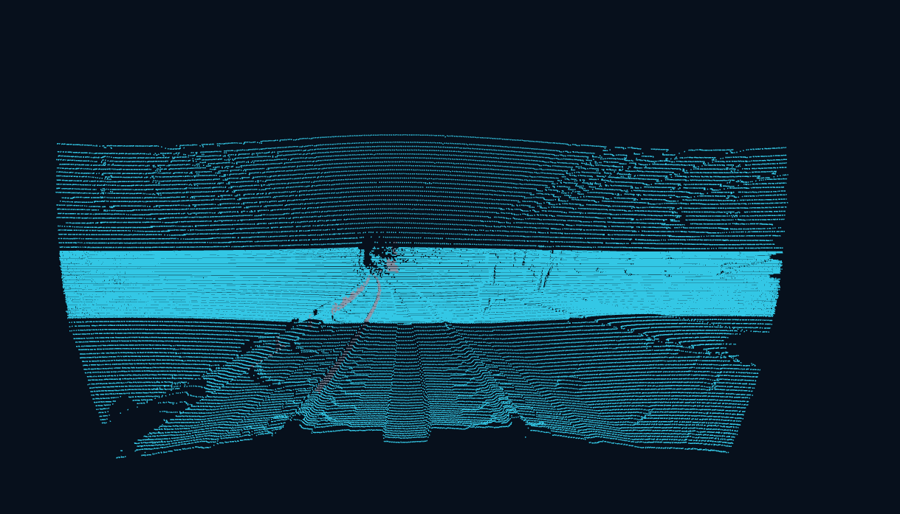
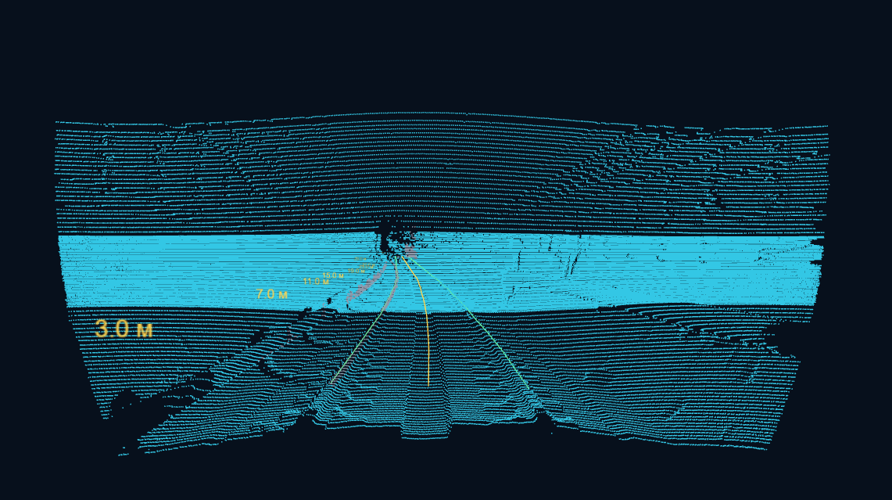
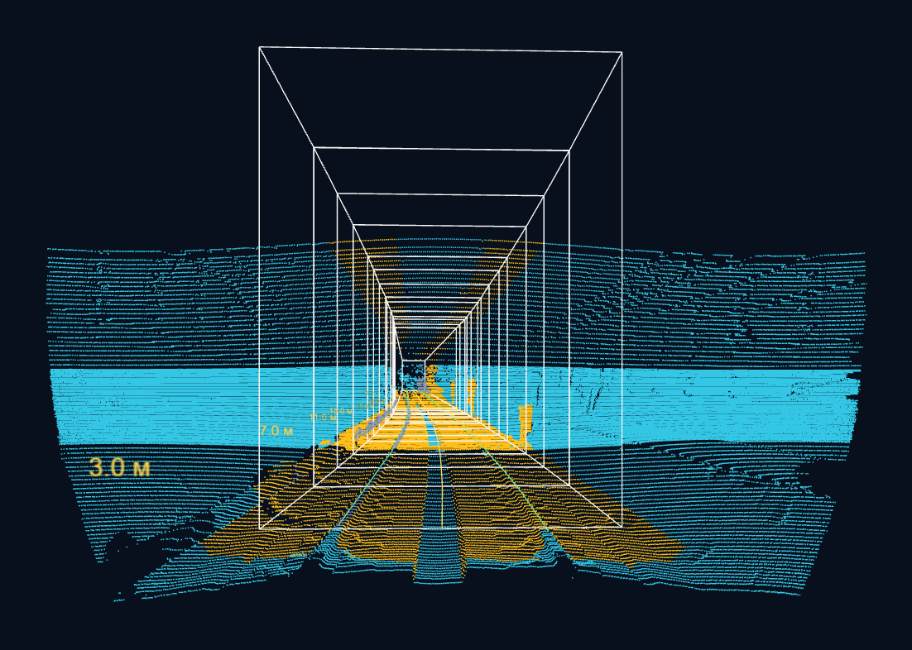
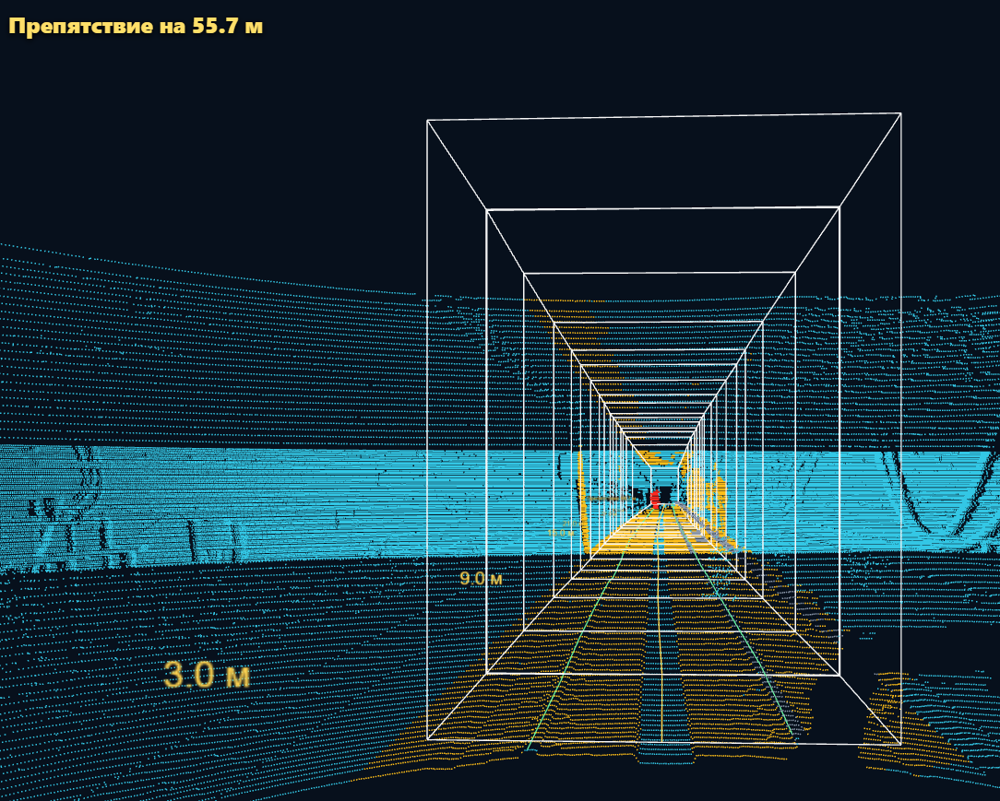

# Описание решения — обнаружение препятствий в тоннеле метро по 3D-лидару

Статус: зафиксированный срез текущего решения на 2026-09-27. После нового датасета заказчика прежний runtime-baseline `candidate_baseline_v2` считается недостаточным как финальная логика принятия решения. Документ обновлён под двухкомпонентный **unified offline candidate**: сначала физическая проверка попадания объекта в габарит поезда, затем `model_v1_temporal` только для слабых/маленьких/неочевидных случаев. ROS2/C++ runtime пока не менялся; финальные графики, таблицы качества, видео и итоговые замеры остаются отдельными пунктами перед сдачей.

## 1. Постановка задачи

Задача хакатона — по данным 3D-лидара обнаруживать посторонние объекты в тоннеле метро, которые могут пересекать габарит движения поезда, и выдавать результат в воспроизводимом ROS2/Docker-сценарии. Целевая среда сдачи: **Ubuntu 22.04 + ROS 2 Humble + Docker**.

В текущем решении мы не пытаемся распознать семантический класс объекта (`человек`, `инструмент`, `кабель`). Основной вопрос формулируется физически: **попадает ли наблюдаемый объект в контролируемый габарит движения поезда**. Если объект явно внутри габарита — это помеха. Если объект явно вне габарита или выше поезда — это не помеха. Если случай слабый, маленький или неочевидный — подключается `model_v1_temporal` как дополнительная offline-проверка.

Минимальный выход текущего MVP:

- `intrusion_candidate_present` — есть ли reportable-кандидат препятствия;
- `nearest_reportable_intrusion_distance_from_source_origin_m` — расстояние до ближайшей reportable-точки от начала координат исходного облака;
- `status`, `system_status`, diagnostics — почему решение поддержано, подавлено или неизвестно;
- `safety_decision_permitted=false` — модуль не выдаёт разрешение на движение.

Важное ограничение: `UNKNOWN` и отрицательный ответ модели не означают `CLEAR`. Новый unified offline candidate — это screening-логика для оценки, а не сертифицированная система безопасности и не контур управления поездом.

### Данные

Исходные данные — ROS2 bag с `sensor_msgs/msg/PointCloud2`. В локальном наборе есть два архива:

| Набор | Состав | Сообщений | Длительность |
|---|---:|---:|---:|
| `for_hackathon` | 6 ROS2 bag-сцен | 2 488 | около 250 с |
| `new_data` | 1 длинная запись, 221 SQLite-часть | 11 271 | около 1 199,9 с |

Всего в текущем каталоге плеера используется семь source ID. Для `doubleT_obstacle` принят development-интервал с известным объектом: кадры **13-64 включительно**. Для остальных записей нет независимой событийной разметки; временно они используются как условные negative-сценарии в development-оценке.

Новая вводная от заказчика: на новом датасете прежний baseline, где компонентная модель решала судьбу reportable-кандидата, провалился. Поэтому финальная offline-логика больше не выбирает «лучшую модель шума» как главный критерий. Главный критерий — физическое отношение объекта к габариту поезда; модель используется только как assist для неоднозначных случаев.

Особенности входа, влияющие на метод:

- в bag нет `/tf`, IMU, одометрии, карты и внешней калибровки;
- встречаются два топика: `/lidar_points` и `/sensing/lidar/hesai128/pointcloud`;
- встречаются два `frame_id`: `hesai_lidar` и `lidar_livox`;
- размер облака отличается: 307 200 точек в большинстве сцен и 921 600 точек в `doubleT_obstacle`;
- много `(0,0,0)` возвратов, поэтому декодер обязан учитывать реальные поля и фильтровать неинформативные точки;
- связь bag/header/per-point timestamps не установлена, поэтому эти часы не смешиваются для latency.

Визуальный контекст данных и геометрии показан ниже на кадрах direct player; численный состав набора зафиксирован в таблице выше.

## 2. Архитектура решения

Базовый runtime path до переноса unified candidate:


Интерактивная версия схемы: [obstacle_pipeline.html](assets/solution/obstacle_pipeline.html).

Два способа запуска используют одно C++ ядро:



Интерактивная версия схемы: [runtime_architecture.html](assets/solution/runtime_architecture.html).

### 2.1. Вход и quality gate

Код читает фактическую схему `PointCloud2`: offsets, datatype, count, endian, `point_step`, `row_step`. Нулевые XYZ и невалидные точки не используются как препятствия. `source_frame` и timestamp исходного облака сохраняются в результате.

Для нового bag входной топик и `source_frame` задаются параметрами. Имя топика не считается доказательством системы координат: например, в `doubleT_obstacle` топик содержит `hesai128`, а `frame_id` равен `lidar_livox`.

### 2.2. Ось рельсов и габарит

Вместо жёсткого направления `-Y` текущий C++ путь ищет локальные пары рельсов и строит наблюдаемую ось. Активный режим: `development_candidate`, `RailForwardMinM=2`, `ForwardExtensionMethod=tangent`.

Габарит в текущей реализации:

| Слой | Локальное сечение |
|---|---|
| CORE | `x=[-1,4; 1,4]`, `z=[0; 3,7]` м |
| Expanded | `x=[-1,9; 1,9]`, `z=[-0,5; 4,2]` м |

Габарит протягивается вдоль наблюдаемой оси и synthetic tangent-продолжения до `rail_forward_max_m=80`. Это **параметр обработки**, а не измеренная дальность обнаружения. Профиль, единицы, mounting и физический динамический габарит пока имеют статус `ASSUMED`, поэтому результат остаётся candidate-only.

### 2.3. Unified offline candidate

Raw CORE — все точки внутри текущего габарита до подавления шума. Он сохраняется отдельно от reportable-результата, чтобы отрицательная классификация модели не стирала диагностический слой.

Новая offline-логика:

1. Геометрия сначала проверяет, попадает ли объект физически в габарит поезда.
2. Если объект явно внутри габарита — считаем его помехой.
3. Если объект явно снаружи габарита или выше поезда — не считаем его помехой.
4. Если объект маленький, слабый или геометрия не даёт уверенного ответа — подключается `model_v1_temporal`.
5. Если `model_v1_temporal` подтверждает — считаем объект помехой.
6. Если подтверждения нет — не заявляем TP; `UNKNOWN` не превращается в `CLEAR`.

Реализация offline-проверки зафиксирована в `scripts/build_unified_offline_candidate.py`, результат — поле `unified_offline_candidate_obstacle`. Это **не runtime-контракт ROS2/C++**: интеграция такой композиции в онлайн-узел требует отдельного design/validation шага.

Исторический baseline был одно-деревным `model_v1`/`legacy_tree_v1`: 52 положительных компонента из кадров `doubleT_obstacle 13-64`, 19 313 отрицательных компонентов по development-правилу, признаки размера, плотности и дальности компонента. Затем runtime был переведён на `candidate_baseline_v2 / random_forest_lite`:

- 17 неглубоких деревьев решений;
- score как средняя вероятность по деревьям;
- threshold `0.8064516129`;
- переносимый C++ export в `models/noise_classifier_candidate_baseline_v2.json` и `src/cpp/candidate_baseline_v2_model.inc`;
- без тяжёлой ML runtime-зависимости.

После нового датасета заказчика `candidate_baseline_v2` остаётся воспроизводимым runtime/development baseline, но больше не описывается как финальная логика решения.

### 2.4. Direct player и ROS2-вход

Для исследования записей используется direct C++ player: кадр из архива передаётся в установленный `curve_pipeline_stream_cli` через stdin, результат возвращается JSON через stdout. В этом режиме нет ROS2-транспорта внутри плеера.

Для сдачи и headless-запуска сохранён отдельный ROS2 node:

```text
ros2 bag play
  -> PointCloud2
  -> ros2 run lidar_mosmetro3d_cpp curve_envelope_node
  -> std_msgs/String с JSON
```

Оба пути вызывают одно C++ ядро и активный `candidate_baseline_v2`-фильтр. ROS2 node дополнительно применяет causal temporal confirmation: первый одиночный alarm остаётся диагностическим, второй последовательный alarm подтверждает публичный `intrusion_candidate_present`. Offline evaluator явно разделяет `causal_runtime` и старый диагностический `legacy_adjacent` режим. Новый `unified_offline_candidate` пока работает поверх сохранённых offline-артефактов и не заменяет этот runtime-путь.

### 2.5. Кадры direct player

Ниже показаны контрольные кадры из интерактивного плеера. Голубой слой — исходное облако, белая проволочная рамка — протянутый габарит поезда, жёлтый слой — warning/CORE-зона и rail-axis разметка, красный маркер — reportable-кандидат препятствия.









## 3. Хронология основных доработок

Важный порядок работ был не «сразу обучить модель», а постепенно превратить шумную геометрическую тревогу в проверяемый candidate-only pipeline.

| Шаг | Что сделали | Зачем это было нужно |
|---|---|---|
| 1. Геометрический baseline | Научились читать `PointCloud2`, фильтровать невалидные точки, искать локальную ось рельсов и строить tangent-габарит | Получить первый ответ на вопрос: есть ли точки внутри контролируемого пространства |
| 2. Development-событие | Зафиксировали `doubleT_obstacle`, кадры `13-64`, как первый интервал с известным препятствием | Появилась минимальная положительная опора для настройки и регрессий |
| 3. Raw CORE и reportable-слой | Разделили все точки внутри габарита (`Raw CORE`) и публичные reportable-кандидаты | Модель и фильтры не должны стирать диагностическую картину и превращать unknown в clear |
| 4. Первый ML-фильтр шума | На компонентах CORE обучили простое дерево `model_v1` / `legacy_tree_v1` | Быстро снизить ложные срабатывания и получить объяснимый C++ baseline |
| 5. Оптимизация runtime | Ускорили построение и оценку связных CORE-компонент через spatial/voxel index | Старый активный фильтр на 5 мин `new_data` снизился с p95 `73,8` до `3,8` мс; весь lean compute path — с `118,5` до `49,8` мс |
| 6. Сравнение моделей | Проверили `random_forest`, `lightgbm`, `gradient_boosting`, ensemble и portable `random_forest_lite` | `candidate_baseline_v2` стал лучшим development/runtime baseline, но не финальным решающим правилом после нового датасета |
| 7. Temporal anti-flicker | Добавили causal confirmation: одиночный alarm на одном кадре остаётся диагностическим, публичный сигнал требует последовательного подтверждения | Подавить одиночное мерцание препятствия без заявления, что путь свободен |
| 8. Synthetic path | Начали synthetic dataset / synthetic recall pipeline с point/component labels | Получить controlled-проверки low/thin/новых объектов и отдельный synthetic/fake-object held-out |
| 9. Unified offline candidate | Перешли к двухкомпонентной offline-логике: геометрия габарита как главный критерий, `model_v1_temporal` как assist для слабых случаев | Исправить провал прежнего baseline на новом датасете заказчика и не считать outside/above объекты помехой |

Итого твоя хронология верная по сути. Два нюанса: фильтр по известному препятствию и фильтр шума в проекте тесно связаны через CORE-компоненты, а утверждение про ускорение «в 100 раз» нужно использовать только там, где есть конкретный замер для узкого участка. В подтверждённых числах этого документа зафиксировано ускорение активного старого фильтра примерно в `19x`, а полного lean compute path — примерно в `2,4x`.

## 4. Ключевые решения и обоснования

### Почему геометрия, а не семантическая классификация?

Данных мало, независимой разметки классов нет, а для безопасности важнее не название объекта, а факт пересечения габарита. Поэтому решение сначала строит контролируемую область и ищет нештатную геометрию внутри неё.

### Почему AutoRails и tangent, а не фиксированный `-Y`?

Первичный аудит показал вытянутость облаков вдоль `-Y`, но это наблюдение не является калибровкой направления движения. Автоматический поиск рельсов даёт локальную ось из данных текущего кадра. Synthetic tangent-продолжение позволяет получить рабочий габарит дальше наблюдаемой опоры, но помечается как допущение.

### Почему модель не превращает отрицательный результат в `CLEAR`?

Модель выбрана по одному положительному проезду и набору hard-negative сценариев. Она может подавить низкое или малое препятствие вне наблюдавшегося распределения. Поэтому raw CORE остаётся доступен, `system_status=UNKNOWN` сохраняется, а `safety_decision_permitted=false` не меняется. Модель — фильтр ложных сигналов, а не safety-доказательство свободного пути.

### Почему теперь двухкомпонентная логика?

Новый датасет заказчика показал, что чистый ML/noise-filter baseline неустойчив: он может ошибаться именно там, где физически важно положение объекта относительно габарита. Поэтому offline candidate устроен консервативнее: геометрия принимает очевидные случаи внутри/снаружи габарита, а `model_v1_temporal` подключается только там, где геометрический сигнал слабый или неполный. Это сохраняет смысл задачи: обнаружить помеху движению поезда, а не просто максимизировать метрику компонентного классификатора.

### Почему не LightGBM, если он близок по offline-качеству?

На сохранённом seven-source development-прогоне `candidate_baseline_v2`, `random_forest`, `lightgbm` и `ensemble_v1` делят лучший `FP temporal=193` при `FN=0`. У `lightgbm` чуть ниже raw FP, но он тяжелее для встраивания и проверки в текущем C++ пути. Поэтому для старого runtime выбран `random_forest_lite`: почти тот же offline-результат, простой export и уже проверенный smoke runtime. После нового датасета это решение считается baseline-инфраструктурой, а не финальной логикой candidate.

### Почему два runtime-пути?

Плеер нужен для анализа и визуальной отладки архива. ROS2 node нужен для сдачи и проверки через `ros2 bag play`. Разделение убирает DDS из интерактивного плеера, но сохраняет ROS2-интерфейс для заказчика.

## 5. Текущие результаты

Все числа ниже относятся к development/offline-проверкам. Они полезны для понимания прогресса, но не являются финальной независимой оценкой качества. Старое сравнение моделей сохранено как historical baseline; актуальная логика выбора candidate описана в разделе 5.2.

### 5.1. Историческое seven-source offline-сравнение моделей

Таблица построена по сохранённому артефакту `artefacts/stage_5/noise_model_candidate_hard_negative_all_sources_cal_roundT/noise_model_candidates.json`. `UNKNOWN` не засчитывается как чистый negative-кадр; `FP` ниже включает `UNKNOWN`.

| Метод | Threshold | TP | FN | FP | TN |
|---|---:|---:|---:|---:|---:|
| `candidate_baseline_v2 / random_forest_lite` | 0.806452 | 52 | 0 | 193 | 13 514 |
| `random_forest` | 0.709677 | 52 | 0 | 193 | 13 514 |
| `lightgbm` | 0.967742 | 52 | 0 | 193 | 13 514 |
| `ensemble_v1` | 0.870968 | 52 | 0 | 193 | 13 514 |
| `gradient_boosting` | 0.967742 | 52 | 0 | 354 | 13 353 |
| `legacy_tree_v1` | 0.500000 | 52 | 0 | 463 | 13 244 |
| `decision_tree` / `tree_depth3` | 0.967742 | 52 | 0 | 669 | 13 038 |
| `tree_depth5_min10` | 0.935484 | 52 | 0 | 1 254 | 12 453 |

Переход от одно-деревного `legacy_tree_v1` к `candidate_baseline_v2` снизил development FP с `463` до `193` при сохранении `52/52` кадров известного препятствия. Для лучших кандидатов остаточные `193` FP приходят из `UNKNOWN`/upstream-status, а не из ML-компонентного alarm после temporal.

Ограничение: `52/52` — это воспроизведение development-события, использованного при разработке. Независимого положительного real test пока нет.

Ограничение после нового датасета заказчика: эта таблица больше не является аргументом в пользу выбора финальной логики. Она показывает только, почему `candidate_baseline_v2` был хорошим старым runtime baseline.

### 5.2. Unified offline candidate

Проверка построена артефактом `artefacts/stage_5/unified_offline_candidate_20260925/summary.json`; подробный отчёт — `docs/stages/stage_5/stage_5_unified_offline_candidate.md`.

| Source | Positive hit | Boundary obstacle FP | Alarm frames | Notes |
|---|---:|---:|---:|---|
| `cloud_with_fake_obj` | 6/6 scorable | 0/2 | 26 | #10 остаётся unlocalized/unscorable |
| `doubleT_obstacle` | 1/1 | n/a | 52 | кадры `13..64` |

Для `cloud_with_fake_obj` два boundary-сценария не стали помехами: #7 outside, кадры `630..633`; #8 above, кадры `674..681`. Для `doubleT_obstacle` серия `model_v1_temporal` восстановлена из сохранённых метрик: `52` alarm frames, `52` TP, `0` FN, `0` FP на известном интервале `13..64`.

Ограничение: это offline event benchmark, не runtime/safety decision. События с `frame_interval=null` не засчитываются как scorable hit/miss; `UNKNOWN` не считается `CLEAR`.

### 5.3. Скорость вычислительного C++ ядра

Lean benchmark выполнен на первых 5 минутах `new_data`: 3 000 кадров. Он измеряет C++ stream без ROS2, HTTP, чтения архива и отрисовки.

| Запуск | FP кадров | FP/мин | TN кадров | p95 обработки, мс/кадр | p95 CORE до фильтра, мс/кадр | p95 активного фильтра, мс/кадр |
|---|---:|---:|---:|---:|---:|---:|
| Historical lean C++ legacy tree | 129 | 25,8 | 2 842 | 118,5 | 47,9 | 73,8 |
| Legacy tree с voxel index для CORE-компонент | 129 | 25,8 | 2 842 | 49,8 | 47,0 | 3,8 |
| Current lean C++ `candidate_baseline_v2` | 0 | 0 | 2 991 | 51,4 | 48,4 | 4,1 |

Старый runtime baseline `candidate_baseline_v2` на этом окне даёт `0` FP и p95 активного фильтра `4,1` мс. Это ниже инженерного ориентира 100 мс/кадр для 10 Гц, но не доказывает real-time полного решения: ещё нужны ROS2 replay, queue/drops, I/O и стендовые ресурсы.

Полная таблица ROS2-path с p50/p95/p99, FPS, drops и ресурсами пока не заявляется: текущий подтверждённый замер относится к lean C++ stream.

### 5.4. Интеграционные проверки

Проверены ограниченные сценарии:

| Проверка | Результат | Граница |
|---|---|---|
| Direct player | Архив -> XYZ -> C++ stdin/stdout -> HTTP JSON работает; `runtime_transport=direct_cpp` | Не проверяет весь датасет, p95 и WebGL вручную |
| ROS2 node | `PointCloud2 -> curve_envelope_node -> std_msgs/String JSON` работает на контрольном bag | Не доказывает sustained throughput и качество на новых объектах |
| Direct/ROS2 parity | Совпадение контрольных полей на выбранных кадрах | Проверка интерфейсов, а не независимое качество модели |
| Runtime smoke после замены baseline | `doubleT_obstacle` frame 13: `noise_filter_mode=candidate_baseline_v2`, `model_noise_filter_type=forest_lite_mean_tree_probability`, `intrusion_candidate_present=true` | Один кадр, не full replay |
| Unified offline candidate | `doubleT_obstacle: 1/1`, `cloud_with_fake_obj: 6/6 scorable`, outside/above: `0` obstacle FP | Offline screening; ROS2/C++ runtime не менялся |

Демонстрационные кадры плеера добавлены в раздел 2.5. Они иллюстрируют облако, ось рельсов, габарит, warning/CORE-зону и найденный reportable-кандидат с ближайшей дистанцией.

## 6. Что уже реализовано и что не заявляется

| Возможность | Статус | Комментарий |
|---|---|---|
| Docker Humble/Jammy и C++ пакет | Реализовано | Нужна финальная чистая проверка перед сдачей |
| Чтение `PointCloud2` | Реализовано | Есть проверка схемы, offsets и source frame |
| AutoRails и tangent-габарит | Реализовано, assumed | Физическая калибровка не подтверждена |
| Raw CORE | Реализовано | Не удаляется моделью |
| `candidate_baseline_v2` | Реализовано | Старый runtime/development baseline, не финальная logic после нового датасета |
| Unified offline candidate | Реализовано offline | Геометрия габарита + `model_v1_temporal` assist; не runtime ROS2/C++ |
| Offline temporal modes | Реализовано | `causal_runtime` default, `legacy_adjacent` только для диагностики |
| Direct C++ player | Реализовано | Для анализа и визуализации |
| ROS2 node | Реализовано | Для headless-сценария сдачи |
| Runtime temporal confirmation | Реализовано в ROS2 candidate path | Добавляет задержку 1 кадр для публичного сигнала |
| CUDA | Не active default | Экспериментальный путь |
| Deskew / TF / карта | Не выполняются | Нет необходимых входов и проверки эффекта |
| Synthetic split/evaluator | Реализовано | Есть train/calibration/synthetic_held_out split и evaluator; real-world recall остаётся проверкой жюри |
| Сравнение ML-кандидатов | Реализовано | Seven-source development screening с явным temporal mode и C++ export-кандидатом |
| Tracking / TTC / risk | Не active default | Не блокирует MVP |
| Production safety / CLEAR | Не заявляется | `UNKNOWN`, `safety=false` сохраняются |

## 7. Известные ограничения

1. **Локального independent real positive test не будет.** Реальный recall проверяет жюри на скрытых данных. Внутри проекта для финальной локальной проверки остаётся отдельный synthetic/fake-object positive held-out `dataset/for_hackathon/cloud_with_fake_obj`, который нельзя использовать для обучения, подбора порогов или выбора baseline.
2. **Геометрия assumed.** Нужны внешние оси, extrinsics, профиль поезда, путь и safety margin, чтобы перейти от candidate-only к проверенному габариту.
3. **Расстояние считается от source origin.** Это не расстояние от носа поезда и не продольная дистанция по траектории.
4. **80 м — не дальность обнаружения.** Это максимальный параметр продолжения габарита.
5. **На 100 м текущий лидар не даёт достаточно плотной геометрии для различения типов объектов.** Смысл такой: генератор “нарисовал” синтетический объект в облаке, но классификатор учится не по самому факту вставки объекта, а по **компонентам**, которые наш реальный C++ pipeline смог выделить внутри CORE-зоны.

   Цепочка такая:

   1. Synthetic insertion добавляет точки объекта в point cloud.
   2. C++ pipeline прогоняет облако как настоящее:
      - проверяет rail-axis / CORE-зону;
      - ищет точки внутри рабочей области;
      - группирует соседние точки в connected components;
      - отбрасывает слишком мелкие/редкие/шумовые группы.
   3. Только если после этого появилась пригодная CORE-компонента, placement можно считать положительным train-примером.

   На 100 м объект часто даёт мало лидарных возвратов. Например, объект есть, но вместо плотного “пятна” получаются 3-10 разрозненных точек. Для человека это “синтетический объект вставлен”, но для pipeline это выглядит как шум или слишком слабая группа. Поэтому он говорит не “вот препятствие-компонента”, а примерно: “есть какие-то sparse core groups / noise ignored”.

   То есть:

   - **synthetic returns есть** = точки объекта попали в облако;
   - **valid CORE-positive component есть** = эти точки пережили реальную геометрию, фильтры и группировку как обучаемый объект.

   У нас на 100 м первое часто есть, второе почти отсутствует. Поэтому такие примеры нельзя честно класть в positive train: модель училась бы на placement “объект есть”, но входного компонента, который она должна классифицировать, фактически нет.

   Практические варианты решения:

   - заменить тип лидара на модель с большей угловой плотностью/разрешением и лучшей дальностью по малым объектам;
   - поставить два лидара по принципу стереопары, чтобы увеличить число возвратов, уменьшить слепые зоны и стабилизировать форму компоненты;
   - использовать мультикадровое накопление с проверенным deskew/синхронизацией движения, чтобы набирать больше точек по одному физическому объекту без размазывания;
   - добавить ближний/дальний специализированный датчик или второй диапазон обзора для тонких и низких объектов;
   - для 100 м формулировать задачу как “обнаружить нештатную геометрию”, а не “различить тип объекта”, пока плотность облака не подтверждает семантическую классификацию.
6. **Старый baseline провалился на новом датасете заказчика.** Поэтому `candidate_baseline_v2` не должен быть единственным критерием помехи; финальная offline-логика должна сначала проверять физическое попадание в габарит.
7. **Synthetic/fake-object данные не являются real recall.** Они нужны для controlled-сравнения кандидатов и локального held-out, но не заменяют скрытую проверку жюри на реальных данных.
8. **Full real-time не подтверждён.** Есть lean compute timing, но нужен полный ROS2 replay с очередью, drops, p95 и ресурсами.
9. **Unified offline candidate ещё не online runtime.** Перед переносом в ROS2/C++ нужно отдельно спроектировать композицию геометрии, `model_v1_temporal`, `UNKNOWN` и outside/above решений.

## 8. Открытые направления

| Направление | Что должно дать | Статус |
|---|---|---|
| Runtime design для unified candidate | Перенести offline-логику в online-контракт без потери `UNKNOWN` и без ложного `CLEAR` | Следующий обязательный design/validation шаг |
| Independent synthetic/fake-object held-out | Проверить recall на отдельном `cloud_with_fake_obj`, который не участвовал в обучении, калибровке, подборе порогов и выборе baseline | Доступен; нужен финальный read-only прогон |
| Real regression для synthetic-trained кандидатов | Проверить, что модели, улучшившие low/thin synthetic recall, не возвращают FP на семи real-source negative/dev источниках | Следующий gate перед runtime replacement |
| Overlap-анализ FP/FN для новых кандидатов | Понять, какие ошибки synthetic-trained модель добавляет или убирает относительно `candidate_baseline_v2` | Нужен после полного causal real/synthetic сравнения |
| 100 м low/thin стратегия | Решить, остаётся ли 100 м documented limitation или требуется другой сенсор/накопление/новая постановка | Открыто: текущая плотность возвратов не даёт устойчивые CORE-positive компоненты |
| Full ROS2 replay | Проверить устойчивость, p95, drops и ресурсы | Перед финальной сдачей |
| Видео и демонстрация | Показать `ros2 bag play -> result -> визуализация` | Перед финальной сдачей |

## 9. Воспроизводимость

### Direct player

Ниже — воспроизведение текущего старого runtime path с `candidate_baseline_v2`. Он нужен для демонстрации контейнерного ROS2/C++ пути, но не является полным запуском новой unified offline candidate логики.

```powershell
docker ps -q --filter "publish=8100" | ForEach-Object { docker stop $_ }
.\scripts\run_stage_2_cpu_player.ps1 `
  -Port 8100 `
  -RailSelectionMethod development_candidate `
  -RailForwardMinM 2 `
  -ForwardExtensionMethod tangent `
  -NoiseFilterMode candidate_baseline_v2 `
  -RebuildImage
```

После запуска открыть `http://localhost:8100/`, выбрать источник и кадр. Контрольный development-сценарий: `doubleT_obstacle`, кадр 13 — candidate; кадр 145 — no reportable candidate.

Проверка выбранного режима:

```powershell
$manifest = Invoke-RestMethod 'http://localhost:8100/api/cpu_sources/doubleT_obstacle/manifest.json'
$manifest | Select-Object runtime_transport, noise_filter_mode, rail_selection_method, rail_search_config, forward_extension_config
```

### Headless ROS2 path

Пример для распакованного `dataset/extracted/doubleT_obstacle`:

```powershell
docker build -t lidar-mosmetro3d:stage-4-cpu-viewer .
$bagPath = (Resolve-Path 'dataset/extracted/doubleT_obstacle').Path

docker run --rm -d --name lidar-detector --shm-size=1g `
  -e ROS_DOMAIN_ID=172 -e ROS_LOCALHOST_ONLY=1 `
  --mount "type=bind,source=$bagPath,target=/data,readonly" `
  lidar-mosmetro3d:stage-4-cpu-viewer `
  ros2 run lidar_mosmetro3d_cpp curve_envelope_node --ros-args `
  -p input_topic:=/sensing/lidar/hesai128/pointcloud `
  -p source_frame:=lidar_livox `
  -p output_topic:=/stage_3/curve_envelope_candidate `
  -p compute_backend:=cpu `
  -p rail_selection_method:=development_candidate `
  -p rail_forward_min_m:=2.0 `
  -p forward_extension_method:=tangent `
  -p noise_filter_mode:=candidate_baseline_v2
```

В отдельном окне:

```powershell
docker exec -it lidar-detector /ros_entrypoint.sh `
  ros2 topic echo /stage_3/curve_envelope_candidate std_msgs/msg/String --field data
```

В третьем окне:

```powershell
docker exec -it lidar-detector /ros_entrypoint.sh ros2 bag info /data
docker exec -it lidar-detector /ros_entrypoint.sh ros2 bag play /data --rate 1.0 --read-ahead-queue-size 2
```

Остановить:

```powershell
docker stop lidar-detector
```

## 10. Что добавить перед финальной сдачей

1. Финальную таблицу версий: commit, image digest, model version, config, dataset/split.
2. Обновить архитектурные SVG/HTML-схемы, если изменятся entrypoint-ы, модель или runtime-контракт.
3. Зафиксировать runtime-дизайн unified candidate: inside/outside/above geometry, weak-case `model_v1_temporal`, `UNKNOWN`, temporal policy.
4. Финальную таблицу качества по выбранному split/protocol: TP/FN/FP/TN, UNKNOWN, FP frames/min, FP events/min.
5. Срезы качества: distance band, low/thin/regular, zone, source run.
6. Runtime-таблицу полного пути: p50/p95/p99, FPS, drops, CPU/RAM/GPU, стенд.
7. Графики FP/мин и confusion matrix.
8. Примеры кадров: TP, FP, FN/UNKNOWN, low/thin synthetic, сложный negative, outside/above negative.
9. Видео демонстрации: контейнер, `ros2 bag play`, результат JSON/визуализация.
10. Явный список того, что не входит в MVP: карта, deskew, TTC, production safety, управление поездом.

Перед публичным push дополнительно выполняется read-only проверка репозитория:

```powershell
python .\scripts\check_submission_package.py
```

Для финального release-коммита:

```powershell
python .\scripts\check_submission_package.py --require-clean
```

Эта проверка не доказывает качество детекции или real-time; она только защищает
сдачный репозиторий от случайно tracked датасетов, архивов, тяжёлых медиа,
секретов и отсутствующих обязательных файлов.

## 11. Короткий вывод

Главный рычаг текущего решения — не ML-модель сама по себе, а формулировка задачи через физический габарит: сначала понять, попадает ли объект в пространство движения поезда; затем для слабых/маленьких случаев использовать `model_v1_temporal` как assist; и никогда не превращать неопределённость в `CLEAR`.

Текущий MVP уже имеет два проверенных входа в одно C++ ядро: интерактивный direct player для анализа и ROS2 node для сдачи через `ros2 bag play`. Но после нового датасета заказчика `candidate_baseline_v2` остаётся только старым runtime/development baseline. Актуальный offline candidate — двухкомпонентный: geometry-first по габариту, затем `model_v1_temporal` для неоднозначных случаев. Следующий шаг — спроектировать перенос этой логики в runtime, выполнить полный ROS2 replay финальной версии и добавить графики/видео в этот документ.
