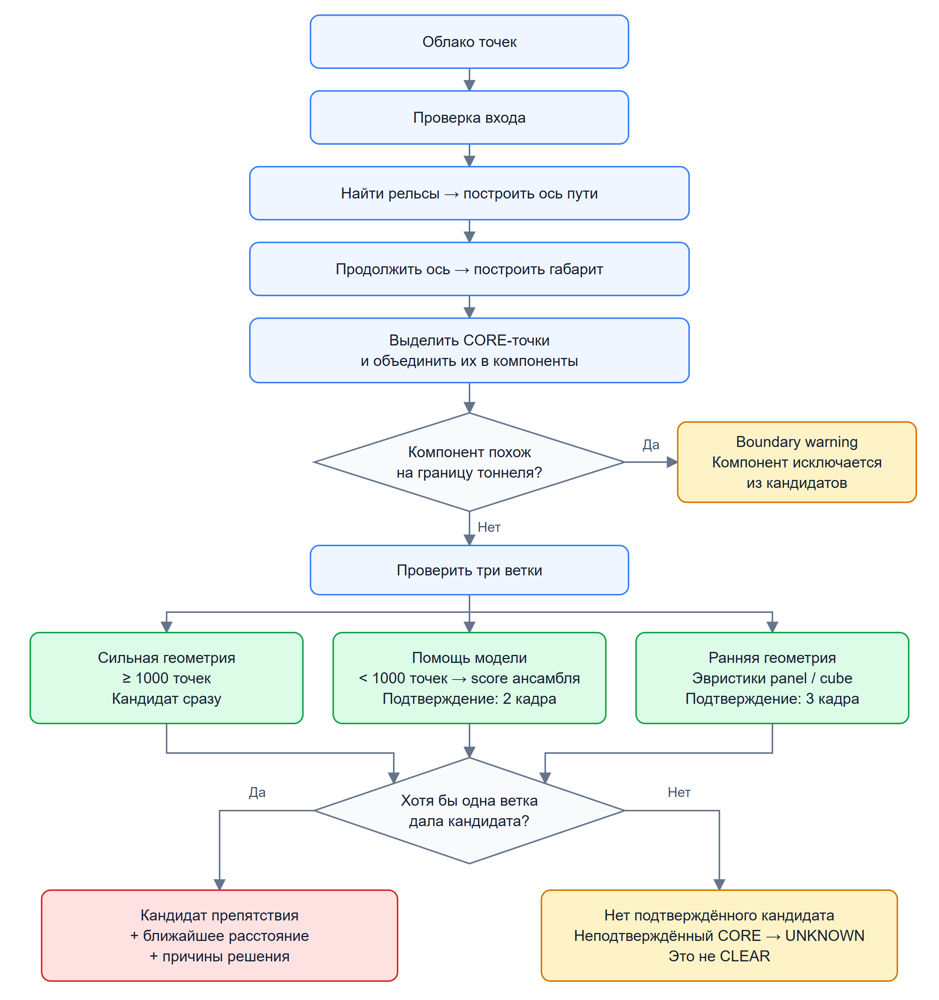
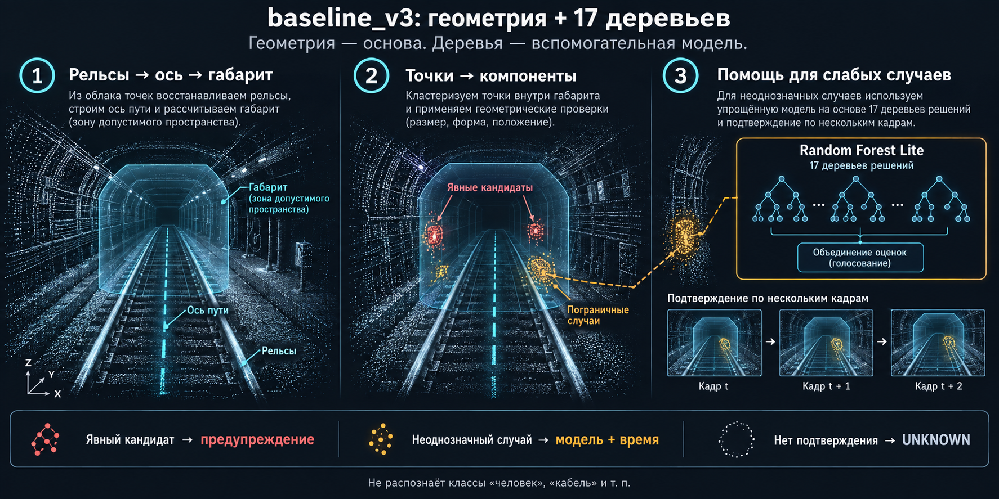

# Описание решения

Статус: срез для сдачи на 2026-09-27; описание веток, условий запуска и
локальных результатов уточнено 2026-09-29 без нового runtime-прогона. Это хакатонный прототип для
обнаружения кандидатов препятствий в габарите движения поезда метро по данным
3D-лидара. Решение не является сертифицированной системой безопасности и не
выдаёт разрешение на движение поезда.

## 1. Кратко

Решение принимает облако точек `sensor_msgs/msg/PointCloud2`, строит локальную
ось рельсов, протягивает вдоль неё габарит поезда и ищет связные компоненты
точек внутри контролируемой зоны. Текущий финальный исполняемый путь —
`baseline_v3 runtime`: geometry-first gate, boundary/warning для объектов вне
или выше габарита. Положительный результат дают три ветки: strong geometry
без temporal-ожидания, model-assist с подтверждением за 2 кадра и отдельная
early geometry с подтверждением за 3 кадра. Окна указаны для текущих параметров
запуска. Если ни одна ветка не даёт положительного результата, неподтверждённый
слабый случай остаётся `UNKNOWN`, не `CLEAR`.

Внутренний score слабой ветки перенесён в `baseline_v3`; отдельной финальной
моделью он не является.

Основной выход:

- `intrusion_candidate_present` — найден ли reportable-кандидат препятствия;
- `nearest_reportable_intrusion_distance_from_source_origin_m` — расстояние до
  ближайшей reportable-точки от начала координат исходного облака;
- `status`, `system_status`, diagnostics — почему кандидат найден, подавлен
  или состояние осталось неопределённым;
- `safety_decision_permitted=false` — модуль не разрешает движение.

Важно: `UNKNOWN` и отсутствие reportable-кандидата не означают подтверждённый
`CLEAR`.

## 2. Что получает проверяющий

Репозиторий содержит:

- Docker-сборку на базе `ros:humble-ros-base-jammy`;
- C++ ядро обработки облака;
- ROS2 node `curve_envelope_node` для сценария `ros2 bag play`;
- direct HTTP-плеер для просмотра подготовленных датасетов;
- скрипты подготовки локальных датасетов из `dataset/raw`;
- документацию и gate-проверку состава репозитория для сдачи.

Данные не входят в Git и Docker image. Проверяющий кладёт архивы локально в
`dataset/raw`, затем запускает подготовительный скрипт.

## 3. Входные данные

Ожидаемый runtime-вход — запись ROS2 с сообщениями
`sensor_msgs/msg/PointCloud2`.

Поддерживаемые практические варианты:

- direct player/catalog: архивы в `dataset/for_hackathon`;
- headless ROS2: папка с распакованной записью в `dataset/extracted/<source>`.

Для player-сценария проверки используются три локальных архива без расширения:

```text
dataset/raw/for_hackathon
dataset/raw/new_data
dataset/raw/cloud_with_fake_obj
```

После подготовки они появляются как ignored-файлы/каталоги в
`dataset/for_hackathon` или `dataset/extracted`. Эти пути намеренно не
отслеживаются Git.

## 4. Архитектура

### 4.1. Компоненты и интерфейсы

Оба режима запуска используют общее C++ ядро: `auto_rails_core` и
`curve_envelope_core`. Пунктирные стрелки обозначают вызовы ядра из адаптеров;
ядро возвращает им геометрию и покадровых кандидатов. Temporal-состояние
и формирование public JSON реализованы отдельно в CLI и ROS2 node.

<a href="assets/diagrams/solution_architecture.svg"></a>

Схема показывает **два способа запуска одного алгоритма**.

**Слева — просмотр через браузер:**

1. Python читает записанные облака из архива и извлекает координаты точек XYZ.
2. Передаёт их программе на C++ — `stream CLI`.
3. C++ обрабатывает облако и возвращает результат в JSON.
4. Python HTTP-сервер передаёт облако и результат браузерному плееру.

**Справа — работа через ROS2:**

1. `ros2 bag play` воспроизводит запись и отправляет облака как сообщения `PointCloud2`.
2. `curve_envelope_node` принимает и обрабатывает их.
3. Публикует результат в ROS2-топик. Его можно читать командой `topic echo` или собирать для измерений.

**Посередине — общее C++ ядро.** Оба способа запуска используют один код поиска рельсов, построения габарита и выделения кандидатов препятствий. Пунктирные стрелки обозначают обращение к этому коду.

Надпись **temporal state** означает память о предыдущих кадрах для подтверждения кандидата за 2 или 3 кадра. У CLI и ROS2 эта память отдельная.

Стрелки вниз показывают передачу данных. Левая и правая части — два альтернативных режима запуска; они не передают результаты друг другу.

Direct-путь читает архив через Python, передаёт XYZ в C++ через stdin и
возвращает результат через stdout в HTTP catalog. ROS2-путь получает
`PointCloud2` и публикует JSON в `std_msgs/String`. Схема показывает поток
данных; reader и HTTP catalog входят в одну Python-обвязку.

### 4.2. Pipeline принятия решения

<a href="assets/diagrams/solution_pipeline.png"></a>

[Открыть схему в SVG](assets/diagrams/solution_pipeline.svg)

После построения габарита точки разделяются на CORE, MARGIN и OUTSIDE.
Компоненты и признаки для `baseline_v3` вычисляются по CORE-точкам.
Boundary-фильтр применяет эвристики к этим компонентам; он не тождественен
попаданию точки в MARGIN или OUTSIDE. Подавление одного компонента не отменяет
alarm от другого компонента того же кадра.

Для компонентов, не подавленных boundary-фильтром, действуют три ветки:

- **Strong geometry:** минимум 1000 точек, кандидат без temporal-ожидания.
- **Model-assist:** для компонентов меньше 1000 точек — ансамбль деревьев,
  порог score и подтверждение за 2 обрабатываемых кадра.
- **Early geometry:** panel/cube-эвристики с ограничениями размера, положения,
  числа точек и дальности; подтверждение за 3 кадра независимо от assist-score.

Temporal-подтверждение выполняют адаптеры; окна 2/3 соответствуют параметрам
запуска в этом документе. Итоговый alarm объединяет ветки через OR.
Неподтверждённый CORE без другого alarm остаётся `UNKNOWN`. Невалидный вход
или недостаточная опора рельсов также не дают решения о свободном пути:
ROS2 node выдаёт `UNKNOWN`, а direct decoder может отклонить вход ошибкой.
Терминальные блоки UNKNOWN и boundary warning на схеме обозначают состояния
и диагностику; это не отдельные физические выходные интерфейсы.

Public JSON содержит кандидата, расстояние от source origin и diagnostics.
`safety_decision_permitted=false`; отсутствие кандидата не означает `CLEAR`.

Входной топик и `source_frame` задаются параметрами. Имя топика не считается
доказательством системы координат: `source_frame` должен соответствовать
реальному `header.frame_id` сообщения.

## 5. Алгоритм

В текущем `baseline_v3` используется **геометрическая обработка + ансамбль деревьев решений**, а не одно дерево.

Порядок такой:



1. По рельсам строится ось пути и габарит поезда.
2. Точки внутри габарита объединяются в компоненты; геометрические правила выделяют явные кандидаты и пограничные случаи.
3. Для слабых или неоднозначных компонентов подключается **Random Forest Lite из 17 деревьев** и подтверждение за 2 кадра.
4. Отдельная early geometry-ветка проверяет геометрические признаки panel/cube
   и подтверждается за 3 кадра; положительный score ансамбля ей не требуется.

То есть геометрия — основа, а деревья — вспомогательная модель. Они не распознают классы «человек», «кабель» и т. п.

1. Декодируется фактическая схема `PointCloud2`: поля, offsets, datatype,
   endian, `point_step`, `row_step`.
2. Невалидные и нулевые XYZ-точки не используются как препятствия.
3. Из текущего облака выбираются наблюдаемые пары рельсов.
4. По ним строится локальная ось пути.
5. Вдоль оси протягивается контролируемый габарит.
6. Точки внутри CORE-зоны группируются в компоненты.
7. `baseline_v3` сначала принимает сильные геометрические intrusion-компоненты
   как кандидат препятствия без temporal-ожидания.
8. Внешние/верхние компоненты переводятся в `boundary/warning`, а слабые или
   маленькие случаи проходят через temporal model-assist: положительный
   результат этой ветки требуется на 2 последовательных обрабатываемых кадрах.
9. Независимо от assist-score проверяется early geometry: ограничения числа
   точек, дальности, положения и размеров компонента по эвристикам panel/cube.
   Кандидат этой ветки становится public alarm после 3 последовательных
   обрабатываемых кадров с early-кандидатом.
10. Итоговый alarm — логическое OR трёх веток. Для reportable-компонент
    вычисляется ближайшая дистанция и диагностический статус; если другая
    ветка не дала alarm, неподтверждённый слабый случай остаётся `UNKNOWN`.

Temporal-подтверждение считает наличие кандидата на уровне кадра; оно не
означает tracking одного и того же физического объекта. Указанные окна 2/3
соответствуют приведённым ниже командам с параметрами по умолчанию.

Текущий исполняемый runtime/smoke-режим:

```text
rail_selection_method = development_candidate
rail_forward_min_m    = 2.0
forward_extension     = tangent
noise_filter_mode     = baseline_v3
```

Параметр 80 м в конфигурации tangent-графа — это предел продолжения рабочей
геометрии, а не подтверждённая дальность обнаружения.

## 6. Визуальный пример

Видео обнаружения препятствий и работы плеера доступны [в папке на Google Drive](https://drive.google.com/drive/folders/1faIDjvqWk145uFcsPRrAioY53D9uxXmo?usp=sharing).

Кадры ниже взяты из локального player-сценария.


## 7. Как запустить

### 7.1. Подготовить данные

Положить исходные архивы в `dataset/raw`, затем из корня репозитория:

```powershell
python .\scripts\prepare_hackathon_datasets.py
```

Если локальный `python` не доступен в `PATH`, используйте установленный
интерпретатор проекта или запустите тот же скрипт внутри Docker/Compose.
Скрипт не добавляет данные в Git. Без `--extract` он готовит локальные
ignored-архивы для плеера; распаковка для ROS2 replay показана в §7.4.

### 7.2. Собрать Docker image

```powershell
docker build -t lidar-metro-obstacle-detection:submission .
```

### 7.3. Запустить плеер

Этот PowerShell-сценарий требует заранее подготовленных локальных файлов:

```text
artefacts/stage_3/cpp_envelope_core/fastdds_udp_smoke.xml
artefacts/stage_4/cpu_viewer/vendor/three.min.js
artefacts/stage_4/cpu_viewer/vendor/OrbitControls.js
```

Wrapper проверяет наличие DDS-профиля и `three.min.js`; HTTP-сервер также
читает `OrbitControls.js` из каталога хоста. Эти файлы ignored и не входят в
Git. Команды §7.1–7.2 не создают их на хосте: Docker build размещает vendor
внутри image, а этот wrapper использует файлы из смонтированного репозитория.
Поэтому приведённая команда рассчитана на подготовленную локальную среду;
для чистого checkout подготовка этих prerequisites здесь не автоматизирована.

```powershell
.\scripts\run_stage_2_cpu_player.ps1 `
  -Port 8100 `
  -RailSelectionMethod development_candidate `
  -RailForwardMinM 2 `
  -ForwardExtensionMethod tangent `
  -NoiseFilterMode baseline_v3 `
  -Image lidar-metro-obstacle-detection:submission `
  -NoBrowser
```

Открыть:

```text
http://localhost:8100/
```

В плеере доступны подготовленные источники, включая обычные сцены, длинный
проезд `new_data`, synthetic fake-object dataset и development-сцену
`doubleT_obstacle`.

«Препятствие на XX м» в плеере соответствует public C++ полю
`intrusion_candidate_present=true`. «Возможное препятствие» — дополнительное
предупреждение интерфейса по трём просмотренным последовательным индексам
с early-кандидатом, пока public alarm отсутствует.
В текущем `baseline_v3` C++ также поднимает подтверждённый за 3 обрабатываемых
кадра early-кандидат в `intrusion_candidate_present=true`.
Direct и ROS2 реализуют одинаковые правила веток, но temporal state находится
в разных адаптерах. Исторический parity-прогон проверил последовательность
`doubleT_obstacle` из 201 случая. Равенство результатов при произвольных seek,
повторных HTTP-запросах, работе cache и смене источника не проверено и здесь
не заявляется. Это не гарантия физического препятствия:
47 красных кадров на `new_data` считаются FP по сообщению
пользователя, что в записи препятствий нет; плеер на этом источнике пишет
«Ложная тревога».
Максимальное задетектированное расстояние в доступных пользовательских
positive-окнах плеера — `68.069 м` от source LiDAR origin
(`cloud_with_fake_obj`, `obj01_2x2_center`, кадр `137`). На кадре `142`
расстояние равно `65.708 м`.

### 7.4. Запустить headless ROS2 replay

Сначала распаковать выбранную запись; обычный вызов подготовки из §7.1
не создаёт эту папку:

```powershell
python .\scripts\prepare_hackathon_datasets.py --extract doubleT_obstacle
```

После этого должна существовать папка `dataset/extracted/doubleT_obstacle`
с `metadata.yaml`. Headless wrapper сам архив не распаковывает.

Короткий wrapper для запуска detector container и печати готовых команд:

```powershell
.\scripts\run_submission_ros2_demo.ps1 -BuildImage -StopExisting
```

Пример для распакованного `dataset/extracted/doubleT_obstacle`:

```powershell
$recordingDir = (Resolve-Path 'dataset/extracted/doubleT_obstacle').Path

docker run --rm -d --name lidar-detector --shm-size=1g `
  -e ROS_DOMAIN_ID=172 -e ROS_LOCALHOST_ONLY=1 `
  --mount "type=bind,source=$recordingDir,target=/data,readonly" `
  lidar-metro-obstacle-detection:submission `
  ros2 run lidar_mosmetro3d_cpp curve_envelope_node --ros-args `
  -p input_topic:=/sensing/lidar/hesai128/pointcloud `
  -p source_frame:=lidar_livox `
  -p output_topic:=/stage_3/curve_envelope_candidate `
  -p compute_backend:=cpu `
  -p rail_selection_method:=development_candidate `
  -p rail_forward_min_m:=2.0 `
  -p forward_extension_method:=tangent `
  -p noise_filter_mode:=baseline_v3
```

В отдельном окне:

```powershell
docker exec -it lidar-detector /ros_entrypoint.sh `
  ros2 topic echo /stage_3/curve_envelope_candidate std_msgs/msg/String --field data
```

В третьем окне:

```powershell
docker exec -it lidar-detector /ros_entrypoint.sh ros2 bag info /data
docker exec -it lidar-detector /ros_entrypoint.sh ros2 bag play /data --rate 0.2 --read-ahead-queue-size 20
```

Остановить:

```powershell
docker stop lidar-detector
```

Для новой записи нужно заменить `input_topic` по выводу `ros2 bag info`, а
`source_frame` — по фактическому `header.frame_id` PointCloud2.

На Ubuntu команды `docker` те же; пример для папки с распакованной записью:

```bash
docker build -t lidar-metro-obstacle-detection:submission .
recording_dir="$(realpath /data/lidar_run_01)"
docker run --rm -d --name lidar-detector --shm-size=1g \
  -e ROS_DOMAIN_ID=172 -e ROS_LOCALHOST_ONLY=1 \
  --mount "type=bind,source=$recording_dir,target=/data,readonly" \
  lidar-metro-obstacle-detection:submission \
  ros2 run lidar_mosmetro3d_cpp curve_envelope_node --ros-args \
  -p input_topic:=/your/pointcloud -p source_frame:=your_lidar_frame \
  -p output_topic:=/stage_3/curve_envelope_candidate \
  -p compute_backend:=cpu -p rail_selection_method:=development_candidate \
  -p rail_forward_min_m:=2.0 -p forward_extension_method:=tangent \
  -p noise_filter_mode:=baseline_v3 -p diagnostics_detail:=summary
```

Команды `docker exec` для чтения выхода и воспроизведения записи приведены выше:
они одинаковы для PowerShell и Bash. Перед повторным запуском остановите
контейнер через `docker stop lidar-detector`.

### 7.5. Замерить быстродействие headless ROS2/C++ без плеера

Для performance-проверки основного ROS2 path используйте compact
production/perf diagnostics:

```powershell
.\scripts\run_submission_ros2_demo.ps1 `
  -StopExisting `
  -Rate 1.0 `
  -ReadAheadQueueSize 20 `
  -DiagnosticsDetail summary

python .\scripts\measure_headless_ros2_cpp_performance.py `
  --rate 1.0 `
  --read-ahead-queue-size 20 `
  --expected-messages 201 `
  --collector-timeout-seconds 210 `
  --output-stem headless_ros2_cpp_performance_rate_1p0_summary_diagnostics
```

Если локальный `python` не доступен в `PATH`, используйте установленный
интерпретатор проекта. Скрипт запускает `ros2 bag play /data`, слушает
`/stage_3/curve_envelope_candidate`, считает p50/p95/p99/max по
`processing_ms`, сохраняет `docker stats`, stdout/stderr replay и JSONL
сообщений в `artefacts/current_model_validation/`.

## 8. Зафиксированные проверки и границы evidence

PASS ниже относится к историческим локальным запускам, а не к новой проверке
текущего checkout. При уточнении документа 2026-09-29 сборка и replay не
повторялись. Численные результаты сверены с доступными локальными артефактами
в `artefacts/current_model_validation/`; этот ignored-каталог не входит в Git.

| Проверка | Результат |
|---|---|
| Repo gate `scripts/check_submission_package.py --require-clean` | PASS |
| Docker build `lidar-metro-obstacle-detection:submission` | PASS |
| Direct player на локальных подготовленных архивах | PASS |
| `/datasets.json` в плеере | 8 source ID |
| `cloud_with_fake_obj` manifest | `frame_count=1510`, `runtime_transport=direct_cpp` |
| `doubleT_obstacle` frames 13-14 | frame 13 — model-assist candidate waiting; frame 14 — temporal-confirmed candidate, дистанция около `55.580` м |
| Зафиксированная оценка `baseline_v3` | real frame runtime: `TP=51`, `FN=1`, `FP alarm=50`, `UNKNOWN=13658`; `cloud_with_fake_obj`: `6/6` positive events, `0` boundary FP |
| Direct player HTTP timing `new_data` 1050-1150 | processing p95 `52.25` ms; HTTP wall p95 `133.16` ms; HTTP wall p99 `1932.03` ms |
| ROS2 parity/timing `doubleT_obstacle` | PASS, `201` cases, wall `137.557` s |
| Headless ROS2 wrapper smoke | PASS: `run_submission_ros2_demo.ps1`, `ros2 topic echo --once` получил JSON с `runtime_transport=ros2`, `noise_filter_mode=baseline_v3`, `safety_decision_permitted=false` |
| Headless ROS2 C++ performance без плеера, `doubleT_obstacle`, `--rate 1.0`, `diagnostics_detail=summary` | `188/201` JSON, `processing_ms` p95 `68.10` ms, p99 `70.16` ms, max `71.57` ms; `Message queue starved`, Docker CPU max `146.35%`, RAM max `926.8` MiB |

Источники численных результатов (пути относительно
`artefacts/current_model_validation/`):

| Утверждение | Артефакт |
|---|---|
| TP/FN/FP/UNKNOWN, 47 FP на `new_data`, 6/6 positive events и 0 boundary FP | `evaluation_summary.json` |
| Первый public candidate на кадре 14, около 55.580 м; кадр 137, около 68.069 м | `detection_distance_summary.json` |
| HTTP/processing timing кадров 1050–1150 | `direct_player_http_timing_new_data_1050_1150.json` |
| ROS2 parity: 201 cases, 137.557 s | `ros2_parity_timing.json` |
| Performance: 188/201 и приведённые percentile/resource значения | `headless_ros2_cpp_performance_rate_1p0_summary_diagnostics_summary.json` и соответствующий `*_messages.jsonl` (188 записей) |

В прежнем описании performance были указаны `187/201`, p95 `71.78` ms и image
`sha256:e292698a910bd605d75f571f89f5c10fedb499e6a3259cedf418fcddb001e4be`.
Доступный summary содержит другие числа и не фиксирует дату запуска, commit
или image digest; поэтому этот digest не приписывается обновлённой строке.
Это сверка сохранённых результатов, а не свидетельство ускорения между версиями.
Для следующих замеров нужны отдельные неперезаписываемые run ID с датой,
commit и image digest.

Исторический ROS2 parity-прогон относится к проверенной последовательности
`doubleT_obstacle`; это integration evidence, не независимая оценка качества.
В выбранном performance-артефакте C++ detector path в compact режиме имеет
`processing_ms` p95 `68.10` ms, ниже ориентира `100` ms для потока около
`10 Hz`. Но локальный Windows/Docker replay показывает `188/201` выходных JSON и
`Message queue starved`, поэтому полный end-to-end real-time claim требует
повтора на целевом Ubuntu/Humble/Docker стенде.

Подробный журнал проверок:
`docs/reports/submission/ROS2_HEADLESS_DEMO_VERIFICATION.md`.

Замер быстродействия ROS2/C++ без плеера:
`docs/reports/submission/HEADLESS_ROS2_CPP_PERFORMANCE.md`.

Сводка оставшихся разрывов к критериям жюри:
`docs/reports/submission/SUBMISSION_READINESS_REPORT.md`.

## 9. Ограничения

- Геометрия габарита имеет статус engineering assumption: нет внешней
  калибровки монтажа, `/tf`, карты, IMU и одометрии.
- `source_frame` и направление движения должны быть проверены для новой записи.
- Расстояние считается от начала координат исходного облака, не от носа поезда.
- `baseline_v3` — единая runtime-policy модель; её внутренний слабый score не
  является safety-доказательством свободного пути.
- `baseline_v3` интегрирован в direct/ROS2 runtime, но требует дальнейших
  независимых replay/latency/throughput-проверок перед production-claim.
- `UNKNOWN` не превращается в `CLEAR`.
- Full end-to-end real-time, drops и ресурсы на целевом стенде не заявлены;
  detector compute в сохранённом замере укладывается в `10 Hz`-ориентир, но локальный replay
  зафиксировал недобор выходов и `Message queue starved`.
- CUDA, deskew, tracking, TTC и управление поездом не входят в MVP для сдачи.
- Synthetic/fake-object dataset нужен для демонстрационной проверки, но не
  заменяет скрытую проверку жюри на реальных данных.

## 10. Структура важных файлов

```text
Dockerfile                                      Docker/ROS2 Humble image для сборки C++ ядра и запуска demo.
README.md                                      Основная инструкция по данным, player, ROS2 replay и ограничениям.
SOLUTION.md                                    Описание архитектуры, алгоритма, проверок и границ решения.
scripts/prepare_hackathon_datasets.py          Подготовка локальных архивов и распаковок записей для player/ROS2.
scripts/run_stage_2_cpu_player.ps1             Запуск direct C++ HTTP-плеера с выбранными runtime-параметрами.
scripts/run_submission_ros2_demo.ps1           Headless ROS2 wrapper: detector container, topic echo и bag play команды.
scripts/measure_headless_ros2_cpp_performance.py
                                                Headless ROS2/C++ performance-run без browser/HTTP player.
scripts/headless_ros2_perf_collector.py         Collector, копируемый measurement-скриптом внутрь контейнера.
scripts/serve_stage_2_cpu_catalog.py           HTTP catalog/player server для подготовленных локальных датасетов.
scripts/cpu_catalog_runtime.py                 Python-обвязка C++ runtime для чтения источников и отдачи JSON плееру.
scripts/check_submission_package.py            Read-only gate состава репозитория перед публичной передачей.
src/cpp/                                       C++ ядро geometry/boundary/model-assist pipeline.
src/lidar_mosmetro3d_cpp/                      ROS2 пакет и node `curve_envelope_node`.
models/baseline_v3_runtime_policy.json         Версионированное описание текущей runtime-policy.
web/                                           Статические файлы браузерного player-интерфейса.
docs/REVIEWER_QUICKSTART.md                    Быстрый маршрут проверки для ревьюера.
docs/SUBMISSION_CHECKLIST.md                   Чеклист подготовки публичной сдачи.
docs/reports/submission/                       Evidence/gap отчёты по выполненным проверкам.
```

## 11. Вывод

Прототип для сдачи решает задачу как `baseline_v3 runtime pipeline`: по облаку
точек он строит локальный габарит движения поезда, принимает сильные
геометрические intrusion-компоненты, отделяет boundary/warning и подключает
temporal model-assist за 2 кадра и отдельную early geometry-ветку за 3 кадра.
Предусмотрены Docker, direct player и headless ROS2 replay; описанный запуск
плеера требует локальных prerequisites из §7.3. Сохраняются ограничения MVP:
отсутствие production-safety claim, отсутствие подтверждённого `CLEAR` и
отсутствие доказанного real-time throughput.
