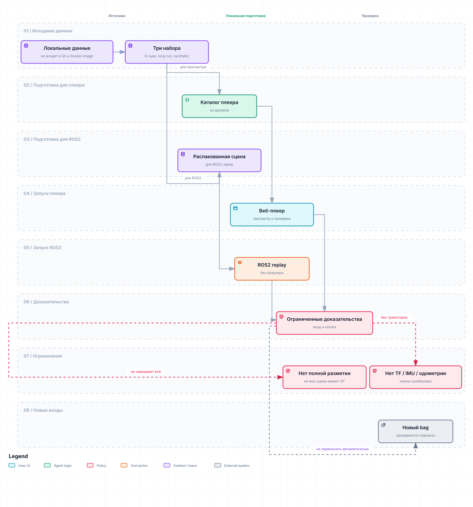

# Описание исходных датасетов

Исходные данные находятся в `dataset/for_hackathon/`. Там три набора: архив `for_hackathon`, отдельный архив `new_data` и отдельный held-out архив `cloud_with_fake_obj`. Это исходники; `dataset/extracted/` содержит только рабочие распакованные копии отдельных сцен и не является отдельным датасетом.

| Исходный набор | Что внутри | Сообщений | Длительность | Сцены / части |
|---|---|---:|---:|---|
| `dataset/for_hackathon/for_hackathon` | Несжатый TAR без расширения | 2 488 | ≈250 с / 4,2 мин | 6 отдельных ROS 2 bag-сцен, перечислены ниже |
| `dataset/for_hackathon/new_data` | Несжатый TAR без расширения | 11 271 | 1 199,88 с / ≈20 мин | 221 SQLite-часть одной записи; части не являются независимыми сценами |
| `dataset/for_hackathon/cloud_with_fake_obj` | Несжатый TAR без расширения | 1 510 | 150,85 с / ≈2,5 мин | 1 SQLite-часть; synthetic/fake-object positive-containing held-out без GT-разметки |

## Использование текущим плеером

Статус: актуальная справка о входах, численные исследования ниже — датированные. [Подготовка](PLAYER_SETUP.md), [основной запуск](../README.md). Каталог открывает все TAR при старте: шесть сцен первого архива плюс `new_data` и `cloud_with_fake_obj` дают восемь source IDs. `dataset/extracted` — необязательные для direct player локальные распаковки; headless ROS2 принимает выбранный распакованный bag.

## Реестр проверенных наблюдений

| Evidence | Граница вывода |
|---|---|
| Первичный аудит 2026-09-18 | Прочитаны metadata/SQLite counters шести bag; свойства PointCloud2 подробно проверены на 12 облаках |
| Полное чтение `roundT_doubleT` и `doubleT_obstacle` | 453 облака штатно десериализованы в Docker/Humble без ошибок схемы; это не проверка всех сцен |
| Дополнение `new_data` 2026-09-20 | Прочитаны metadata всех 221 SQLite-частей; свойства облака проверены на трёх кадрах |
| Direct/ROS2 integration | Проверяет формат и общий C++ runtime на выбранных входах; не доказывает независимое качество или real-time |
| Development interval `doubleT_obstacle` | Положительный интервал 13-64 используется для оценки; это один известный объект, не независимый test set |

В архиве нет `/tf`, IMU, одометрии, карты, внешней разметки и калибровки монтажа.
Имена bag, topic и frame помогают выбрать вход, но сами по себе не задают
направление движения, единицы, профиль поезда или физический габарит. Новые
входы должны валидироваться по фактической схеме `PointCloud2`, а не по имени
файла.

## Сцены внутри `for_hackathon`

| Сцена в архиве | Сообщений | Длительность | Что это |
|---|---:|---:|---|
| `roundT_doubleT` | 252 | 25,07 с | Отдельная записанная ROS2-последовательность от поставщика; событийной разметки нет |
| `squareT_platform_squareT_switch` | 877 | 88,21 с | Отдельная последовательность от поставщика; имя содержит `switch`, но не подтверждает стрелку в кадрах |
| `doubleT_platform` | 345 | 34,42 с | Отдельная записанная ROS2-последовательность от поставщика; событийной разметки нет |
| `roundT_squareT_pressureGate_squareT` | 545 | 55,38 с | Отдельная записанная ROS2-последовательность от поставщика; событийной разметки нет |
| `doubleT_obstacle` | 201 | 20,39 с | Отдельная последовательность от поставщика; есть отдельная пользовательская разметка препятствий |
| `roundT_pressureGate_roundT` | 268 | 26,70 с | Отдельная записанная ROS2-последовательность от поставщика; событийной разметки нет |

Пройденный метраж для исходных наборов неизвестен: нет одометрии, скорости, TF или проверенного межкадрового совмещения. Дальность LiDAR-точек не является длиной пройденного пути.

## Максимальная дальность LiDAR-возвратов в статичных сценах

Для каждой из шести статичных сцен `for_hackathon` измерены три кадра: первый, средний и последний. Из каждого облака исключены неfinite и `(0,0,0)` возвраты; затем рассчитано `sqrt(x² + y² + z²)` от начала координат **исходного** LiDAR-frame. В таблице приведены минимальный и максимальный из трёх покадровых максимумов.

Это расстояние до отдельного возврата, а не пройденный поездом путь, не расстояние от носа поезда и не подтверждённая дальность обнаружения препятствия. Единицы указаны как метры по текущему проектному допущению для source XYZ (`m_ASSUMED`): внешняя калибровка единиц, осей и положения LiDAR пока отсутствует.

| Источник | Кадры | Максимальная дальность возврата, м* |
|---|---|---:|
| `roundT_doubleT` | 0, 126, 251 из 252 | 127,600–206,676 |
| `squareT_platform_squareT_switch` | 0, 438, 876 из 877 | 174,632–204,560 |
| `doubleT_platform` | 0, 172, 344 из 345 | 137,700–200,288 |
| `roundT_squareT_pressureGate_squareT` | 0, 272, 544 из 545 | 96,236–200,040 |
| `doubleT_obstacle` | 0, 100, 200 из 201 | 208,772–209,108 |
| `roundT_pressureGate_roundT` | 0, 134, 267 из 268 | 203,904–208,808 |

\* Диапазон отражает три выбранных кадра, а не всю сцену. Полные покадровые квантили и количество пригодных возвратов были сохранены во внутренних артефактах разработки и не входят в репозиторий для сдачи.

## Движение в `new_data`: пока только диагностическая оценка

В `new_data` поезд движется; максимальная дальность возврата не заменяет его путь. В bag нет одометрии, IMU, TF или внешней траектории. Поэтому выполнен полный offline scan-matching: 1 128 anchor-кадров из всех 221 SQLite-частей, bag timestamps одной записи, origin-centric выборка стен/свода и trimmed ICP между соседними anchor-кадрами. Нулевые/неfinite возвраты исключены. Это **не** runtime-одометрия, не вход deskew/TTC и не эталонная траектория.

| Шаг между anchor-кадрами | Покрытие интервалов ICP | Сумма относительных перемещений | Средняя скорость | Медианный residual / correspondence |
|---|---:|---:|---:|---:|
| 10 кадров (около 1 с) | 1 127 / 1 127 | 47,914 м | 0,040 м/с (0,144 км/ч) | 0,174 м / 25,1% |
| 50 кадров (около 5 с) | 226 / 226 | 18,820 м | 0,016 м/с (0,056 км/ч) | 0,188 м / 19,8% |

Оценки пути расходятся в 2,5 раза при изменении шага. Поэтому из текущих данных можно показать факт движения и построить **грубую диагностическую** LiDAR-оценку, но нельзя честно назвать ни 47,914 м, ни 18,820 м пройденным метражом поезда, а соответствующие скорости — измеренными. Для точного значения нужны одометрия/IMU/внешняя траектория либо независимые контрольные метки пути, после чего LiDAR-ICP можно откалибровать и проверить на drift.

Полные интервалы, residual и overlap были сохранены во внутренних артефактах разработки и не входят в репозиторий для сдачи.

## `cloud_with_fake_obj`: raw CORE внутри габарита до 60 м

`cloud_with_fake_obj` передан организаторами как positive-containing held-out; организаторы подтвердили 10 синтетических объектов и их порядок. Для текущей задачи проекта принята рабочая формулировка: target-positive считается объект, чьи LiDAR-точки попадают внутрь принятого core-габарита поезда на проверенной рельсовой оси; объекты вне/сверху габарита не являются целевыми obstacle. Поэтому в `cloud_with_fake_obj` фиксируется 7 target-positive объектов и 3 boundary/negative объекта. GT-боксов нет, поэтому frame-интервалы ниже являются working labels/локализацией по raw CORE, а не финальной box-level разметкой.

2026-09-25 выполнен read-only геометрический аудит без runtime-policy фильтра: C++ stream строит AutoRails/tangent-габарит, затем берутся **raw `CORE` точки внутри core-габарита поезда** с rail-station `0..60 м`; компоненты считаются Euclidean-связностью `0,25 м`. Это верхняя оценка возможных помех внутри габарита, а не финальная детекция.

По сообщению организаторов, в bag последовательно вставлены 10 синтетических объектов на расстоянии примерно 100 м друг от друга:

| № | Объект по описанию организаторов | Ожидаемый статус относительно core-габарита |
|---:|---|---|
| 1 | Крупный `2×2 м` посередине габарита | Должен быть core-positive |
| 2 | Мелкий `0,3×0,3 м` посередине габарита | Должен быть core-positive, малый объект |
| 3 | Мелкий `0,3×0,3 м` на рельсах | Должен быть core-positive, низкий/rail-level |
| 4 | Мелкий `0,3×0,3 м` скраю габарита | Должен быть core-positive на границе |
| 5 | Мелкий `0,3×0,3 м` за пределами габарита, но близко | Не должен быть core-positive; может попадать в margin |
| 6 | Крупный `2×2 м` скраю в пределах габарита | Должен быть core-positive на границе |
| 7 | Крупный `2×2 м` за пределами габарита | Не должен быть core-positive; может попадать в margin |
| 8 | Крупный `2×2 м` сверху габарита | Не должен быть core-positive, если выше top-bound |
| 9 | Длинный низкий предмет на рельсах `2×0,2 м` | Должен быть core-positive, низкий/длинный |
| 10 | Узкий длинный предмет, свисающий с потолка, ширина `0,05 м` | Принят как target-positive по формулировке постановщиков; точный frame interval ещё нужно локализовать |

Следствие: ожидаемое число физических synthetic-объектов — `10`; рабочее число target-positive событий для проекта — `7`; рабочее число boundary/negative событий — `3`. Покадровые raw-CORE компоненты ниже не являются количеством объектов.

Архив можно распаковать для прямого чтения в `dataset/extracted/cloud_with_fake_obj` (`metadata.yaml`, `cloud_with_fake_obj_0.db3`) через `scripts/prepare_hackathon_datasets.py --extract cloud_with_fake_obj`. Числа ниже не складываются в количество искусственных помех: пороги вложены друг в друга, компоненты покадровые, а без GT неизвестно, какие компоненты являются fake-object TP.

| Порог компонента внутри core-габарита `0..60 м` | Компонентов | Кадров с ≥1 компонентом | Интервалов кадров | Многокадровых интервалов | Самые длинные интервалы |
|---|---:|---:|---:|---:|---|
| `>=22` точек | 10 297 | 1 494 / 1 510 | 3 | 3 | `370..1509` (1140), `0..216` (217), `232..368` (137) |
| `>=250` точек | 847 | 697 / 1 510 | 233 | 119 | `177..216` (40), `1143..1161` (19), `251..265` (15), `1126..1140` (15) |
| `>=500` точек | 152 | 151 / 1 510 | 86 | 24 | `188..216` (29), `576..581` (6), `628..633` (6), `678..681` (4) |
| `>=1000` точек | 30 | 30 / 1 510 | 11 | 5 | `204..216` (13), `630..633` (4), `579..581` (3), `531..532` (2), `1147..1148` (2) |
| `>=2000` точек | 7 | 7 / 1 510 | 3 | 2 | `213..216` (4), `632..633` (2), `581` (1) |
| **Итого raw CORE** | **10 297 компонентов при базовом пороге `>=22`** | **1 494 / 1 510** | **3** | **3** | **1 696 498 raw CORE-точек внутри габарита `0..60 м`** |

Вывод для ручной проверки: raw-геометрия внутри габарита не является однокадровой. Наиболее компактный shortlist крупных возможных помех — кадры `204..216`, `579..581`, `630..633`; при пороге `>=2000` остаются `213..216`, `632..633` и `581`. Без GT неизвестно, какие из этих компонентов являются настоящими fake-object TP, а какие — инфраструктурой/артефактами внутри принятого габарита.

Предварительное сопоставление с описанием организаторов по raw `CORE` признакам:

| № | Описание организаторов | Вероятные кадры / статус по raw `CORE` | Основание | Уверенность |
|---:|---|---|---|---|
| 1 | `2×2 м` посередине габарита | `204..216`, strongest `213..216` | центр `x≈0`, компонент до `2862` точек, extents около `1,96×1,65 м` по двум осям | высокая |
| 2 | `0,3×0,3 м` посередине габарита | около `365..368` | компонент `0,34×0,30×0,30 м`, центр близко к оси | средняя/высокая |
| 3 | `0,3×0,3 м` на рельсах | около `478..480` | малый компонент около `0,29×0,29 м`, низкий/близкий к рельсовой зоне; положение не идеально центрировано | средняя |
| 4 | `0,3×0,3 м` скраю габарита | `530..532` | компонент `0,29×0,27×0,30 м`, lateral near edge `x≈-1,26` | высокая |
| 5 | `0,3×0,3 м` за пределами габарита, близко | не подтверждён по `CORE` | должен быть margin/outside, не core-positive; нужен отдельный margin/top просмотр | низкая |
| 6 | `2×2 м` скраю в пределах габарита | `579..581` | крупный edge-like компонент, до `3827` точек, vertical extent около `2,1 м`, `x≈1,14` | средняя/высокая |
| 7 | `2×2 м` за пределами габарита | возможно `630..633`, но спорно | крупный edge-like компонент, до `3404` точек, `x≈-1,32`; raw `CORE` считает его внутри, что может быть пограничной ошибкой/калибровкой | низкая/средняя |
| 8 | `2×2 м` сверху габарита | не подтверждён по `CORE` | должен быть margin/top или outside, если выше top-bound | низкая |
| 9 | длинный низкий `2×0,2 м` на рельсах | вероятно `1138..1156` и соседние поздние кадры | длинные низкие компоненты: малая ширина `~0,05..0,30 м`, length до `~14 м`, height `~0,25 м` | средняя |
| 10 | узкий длинный свисает с потолка, ширина `0,05 м` | не подтверждён по `CORE` | для ceiling-object нужен просмотр верхней части габарита/margin; raw `CORE` не даёт уверенного отдельного события | низкая |

Это сопоставление эвристическое: оно использует порядок объектов, размеры компонент, положение относительно текущей rail-axis и устойчивость по кадрам. Оно не заменяет GT и должно быть проверено визуально в player.

## Рабочие распаковки

В локальном рабочем окружении на момент описанного исследования были распакованы копии трёх сцен из `for_hackathon`: `doubleT_obstacle`, `roundT_doubleT` и `squareT_platform_squareT_switch`, а также `cloud_with_fake_obj`. Они распакованы только для прямого чтения `.db3` через ROS 2; исходниками остаются архивы в `dataset/for_hackathon/`.

Источник чисел: первичный аудит датасета 2026-09-18/20 и локальный аудит дальностей; внутренние журналы разработки не входят в публичную сдачу.
