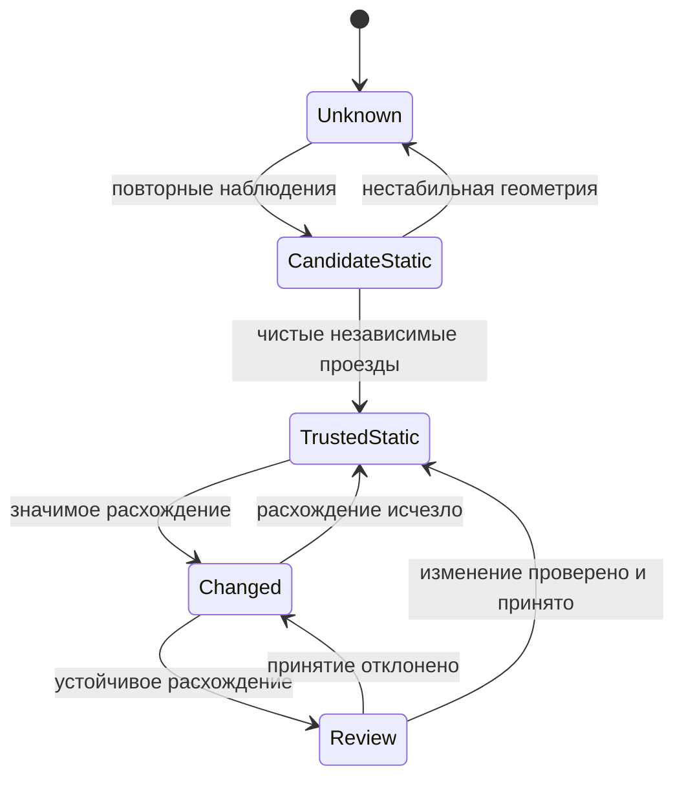
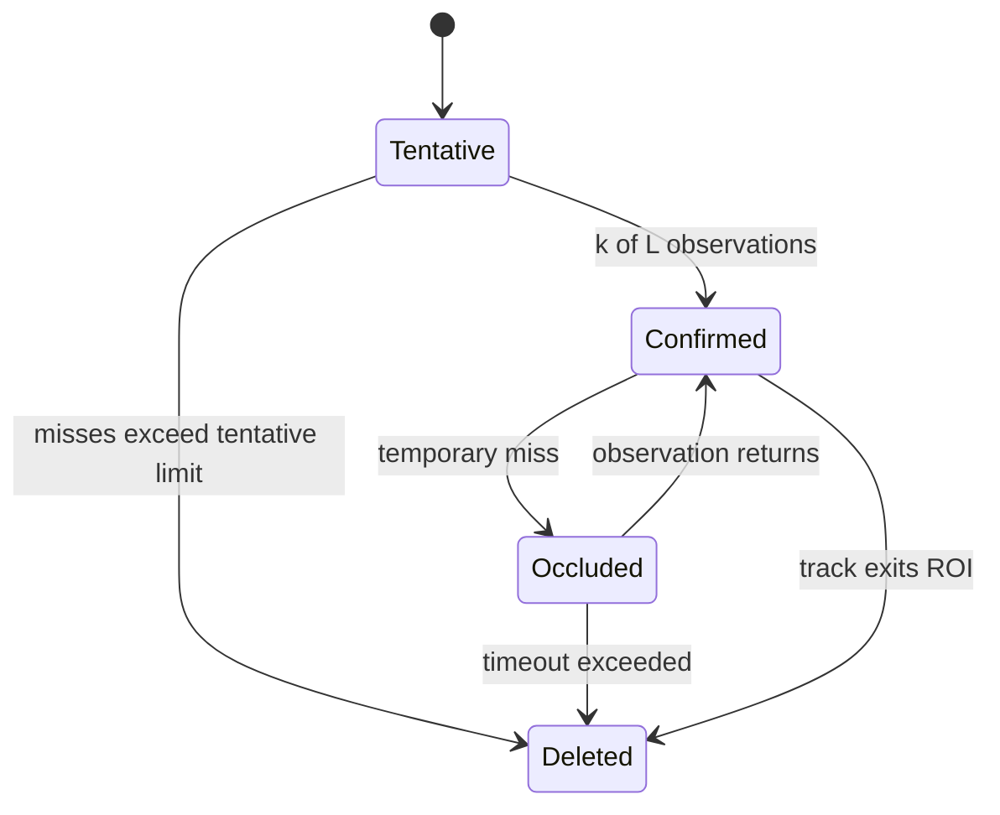
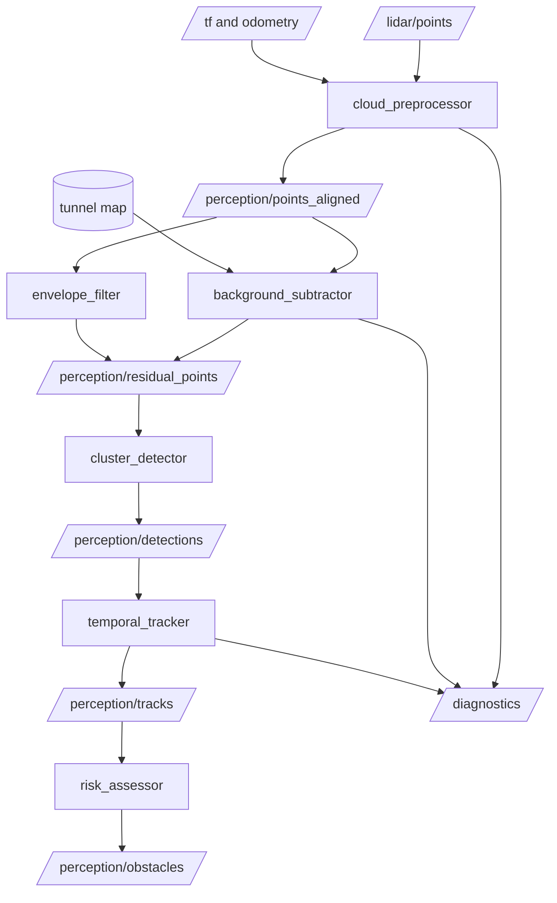

# Методология обнаружения посторонних объектов в тоннеле метро по данным 3D‑лидара

> Проект: **lidar_MosMetro3D**  
> Статус документа: проект методологии для хакатонного MVP, уточнён 2026-09-18 по ТЗ и первичному аудиту<br>
> Основной принцип: обнаруживать не семантический класс объекта, а **новую или нештатную геометрию, пересекающую контролируемый габарит движения поезда**.

Обязательные условия сдачи определяет [ТЗ](hackathon_documentations/5.%20ДепТранспорта.pdf); код, данные и результаты запусков определяют фактическую реализацию. Этот документ описывает выбранный метод, а не расширяет требования конкурса. [Датасетный документ](DATASETS_AND_ASSUMPTIONS.md) фиксирует наблюдения по данным, [история работ](DEVELOPMENT_HISTORY_AND_STATUS.md) — порядок и текущий статус реализации. Текущая C++ реализация и её границы описаны ниже; старые smoke-проверки не являются доказательством нынешнего детектора.

Целевая среда: **Ubuntu 22.04 + ROS 2 Humble + Docker**. Первый MVP выдаёт наличие препятствия, ближайшее расстояние и диагностику. Разделы о карте, deskew, PCA, tracking, TTC и risk описывают расширения; их включение требует входных условий и проверки эффекта, а не обязательно для первого результата.

## Действующая реализация и актуальный кандидат — 2026-09-27

Статус: текущий исполняемый direct/ROS2 runtime использует `baseline_v3` как финальный pipeline проекта. [Запуск](../README.md), [история и статус](DEVELOPMENT_HISTORY_AND_STATUS.md), [проверки перед передачей](reports/submission/SUBMISSION_READINESS_REPORT.md). Позднейшие формулы описывают также возможные расширения: наличие раздела не означает выполнение стадии в runtime.

Актуальный runtime pipeline — `baseline_v3`, а не отдельная ML-модель. Его логика:

1. geometry-first gate проверяет физическое попадание объекта в габарит поезда;
2. явно внутри габарита -> `obstacle`;
3. явно вне/выше габарита -> boundary/warning, не `obstacle`;
4. слабый, маленький или неочевидный случай -> temporal model-assist;
5. temporal подтверждает -> `obstacle`;
6. temporal не подтверждает -> `UNKNOWN`, не `CLEAR`.

Текущий исполняемый direct/ROS2 runtime:

`PointCloud2 / XYZ → AutoRails development_candidate → наблюдаемая ось → tangent-продолжение габарита → raw CORE → компоненты r=0,25 м → baseline_v3 geometry-first/boundary/model-assist → reportable/warning/UNKNOWN, ближайшая точка, diagnostics`.

Плеер использует direct C++ stdin/stdout через `DirectDetailedCpuRuntime`; отдельный `curve_envelope_node` принимает PointCloud2 и публикует String/JSON без браузера. Оба вызывают общее ядро. Raw CORE и фильтрованный reportable — разные результаты; низкий singleton сохраняется в raw, но модель может подавить его сигнал. Текущие правила модели, включая пороги, описаны в документе модели, а не в псевдокоде будущих стадий.

| Блок | Статус в текущем запуске |
|---|---|
| Чтение PointCloud2/конечных ненулевых XYZ | Реализовано; source frame/header сохраняются; физическая калибровка остаётся assumed |
| Рельсы/габарит | C++ локальная цепочка наблюдаемых пар + synthetic tangent, fmin=2, fmax=80; [сечения](TRAIN_ENVELOPE_AND_LIMITATIONS.md) |
| Компоненты/модель | Runtime: связность 0,25 м и `baseline_v3` как geometry-first + boundary/warning + temporal-assist policy; внутренний слабый score входит в `baseline_v3`; не PCA/нейросеть и не семантические классы |
| Выход | `intrusion_candidate_present`, `nearest_reportable_intrusion_distance_from_source_origin_m`, raw/reportable/noise, status; `system_status=UNKNOWN`, safety=false |
| Deskew/TF преобразование/фон/карта | Не выполняются текущей покадровой цепочкой; необходимые входы/доказательства для включения описаны ниже |
| Distance-aware grouping/PCA/tracking/TTC/risk | Проектные расширения; в текущий `baseline_v3` runtime не входят, кроме узкого temporal-assist для слабых/неочевидных случаев |
| Arc/CUDA/синтетика/движение | Отдельные эксперименты; не активны в default tangent/baseline_v3 runtime |

Дистанция — до ближайшей reportable точки от source origin, не от носа поезда. Продолжение до 80 м не доказывает detection range. Независимый положительный test отсутствует; 13–64 — принятое development-событие. Геометрия assumed; отрицательный ответ модели и UNKNOWN не CLEAR.

### Демонстрационная последовательность для презентации

Для презентационного ролика пайплайн показывается слоями, в том же порядке, что и действующая цепочка выше. Эти материалы являются визуальным объяснением метода: они не меняют runtime, не публикуют `CLEAR/NO_OBSTACLE` и не являются safety-доказательством.

| Шаг | Что показывается | Референс |
|---|---|---|
| 1 | Тоннель: только исходное облако точек |  |
| 2 | Рельсы, наблюдаемая ось, расстояния и направляющие |  |
| 3 | Габарит поезда до 80 м поверх оси пути |  |
| 4 | Точки в предупредительном слое `габарит + 0,5 м` |  |
| 5 | Пример препятствия в `doubleT_obstacle` с ближайшей дистанцией |  |

Дополнительные ракурсы для проверки читаемости: [sparse envelope](presentation/picts/reference_03_envelope_sparse.png), [warning margin alt](presentation/picts/reference_04_warning_margin_alt.png). Сгенерированные 5-секундные MP4 для этой последовательности лежат в `docs/presentation/movies/`.

## Оглавление

1. [Назначение и границы решения](#1-назначение-и-границы-решения)
2. [Формальная постановка задачи](#2-формальная-постановка-задачи)
3. [Общая архитектура](#3-общая-архитектура)
4. [Входные данные и первичный аудит](#4-входные-данные-и-первичный-аудит)
5. [Системы координат и компенсация движения](#5-системы-координат-и-компенсация-движения)
6. [Safety envelope и контролируемая область](#6-safety-envelope-и-контролируемая-область)
7. [Предварительная обработка облака](#7-предварительная-обработка-облака)
8. [Модель штатной геометрии и background subtraction](#8-модель-штатной-геометрии-и-background-subtraction)
9. [Редкое оборудование без семантической разметки](#9-редкое-оборудование-без-семантической-разметки)
10. [Distance-aware processing](#10-distance-aware-processing)
11. [Кластеризация и KD-tree](#11-кластеризация-и-kd-tree)
12. [Геометрические и PCA-признаки](#12-геометрические-и-pca-признаки)
13. [Временная фильтрация и трекинг](#13-временная-фильтрация-и-трекинг)
14. [Оценка риска и логика решения](#14-оценка-риска-и-логика-решения)
15. [ROS2-конвейер и контракты сообщений](#15-ros2-конвейер-и-контракты-сообщений)
16. [Псевдокод](#16-псевдокод)
17. [Калибровка, метрики и протокол оценки](#17-калибровка-метрики-и-протокол-оценки)
18. [MVP и критерии готовности](#18-mvp-и-критерии-готовности)
19. [План этапов](#19-план-этапов)
20. [Риски и fallback-стратегии](#20-риски-и-fallback-стратегии)
21. [Матрица трассируемости метода](#21-матрица-трассируемости-метода)
22. [Ограничения и дальнейшее развитие](#22-ограничения-и-дальнейшее-развитие)

---

## 1. Назначение и границы решения

### 1.1. Цель

Первый MVP принимает последовательность сообщений 3D-лидара, работает в проверенной системе координат, выделяет контролируемый габарит и выдаёт наличие препятствия, расстояние до ближайшего и диагностический статус. Подавление штатной геометрии добавляется при подтверждённой применимости. Расширенный выход может включать:

- положение и размеры;
- расстояние по ходу движения;
- глубина пересечения с габаритом;
- идентификатор временного трека;
- достоверность геометрической детекции;
- уровень риска и диагностический статус.

### 1.2. Что именно считается препятствием

**Определённый метод.** Кандидатом на препятствие считается связная группа наблюдаемых 3D‑точек, которая одновременно:

1. находится в зоне релевантной дальности перед поездом;
2. не объясняется доверенной моделью штатной геометрии, если такая модель включена и валидна; в envelope-only этот этап отсутствует;
3. пересекает safety envelope или лежит в заданном предупредительном слое вокруг него;
4. проходит геометрические проверки; временная согласованность проверяется при включённом temporal-режиме.

Система не обязана распознавать семантический класс «кабель», «шкаф», «инструмент» или «человек». Для безопасности важнее ответить на вопрос: **занимает ли неизвестная геометрия пространство, необходимое поезду для безопасного движения?**

### 1.3. Что не заявляется

- Методология не доказывает функциональную безопасность и не заменяет сертификацию.
- Без реальных данных нельзя заранее назначить пороги, гарантировать дальность, полноту или задержку.
- Геометрический confidence не является откалиброванной вероятностью опасности, пока это не подтверждено отдельной калибровкой.
- Хакатонный модуль выдаёт предупреждение/оценку для интеграции; он не должен непосредственно управлять торможением без внешнего safety-контроллера.

---

## 2. Формальная постановка задачи

> Формальная постановка и целевые выходы; фактические поля JSON и candidate-only статус перечислены в разделе действующей реализации.

### 2.1. Наблюдения

В момент времени \(t\) лидар формирует облако:

\[
\mathcal P_t^L = \{p_{i,t}^L\}_{i=1}^{N_t},
\qquad
p_{i,t}^L=(x_{i,t},y_{i,t},z_{i,t},q_{i,t}).
\]

Здесь \(L\) — система координат лидара, \(N_t\) — число точек, координаты измеряются в метрах, а \(q_{i,t}\) обозначает доступные дополнительные поля: intensity, ring, timestamp и другие. Наличие и смысл этих полей должны быть проверены по фактическому сообщению `sensor_msgs/msg/PointCloud2`.

После фильтрации и преобразования получаем облако в рабочей системе координат \(F\):

\[
\mathcal P_t^F = \{T_{F\leftarrow L}(t)\,p_{i,t}^L\}.
\]

Направление преобразования задано явно: \(T_{F\leftarrow L}(t)\) переводит координаты **из лидара \(L\) в рабочую систему \(F\)**.

### 2.2. Выход

Минимальный выход: статус детекции, расстояние до ближайшего кандидата и статус качества входа. До реализации фиксируются единицы, точка отсчёта и смысл расстояния: продольное до ближайшей наблюдаемой точки объекта либо вдоль доступной траектории. Евклидово расстояние до центра кластера нельзя молча выдавать за расстояние по пути. При отсутствии объекта или валидной геометрии расстояние помечается недоступным, не нулевым.

Для расширенного режима объекта \(j\) предлагается:

\[
o_{j,t} = (\mathrm{id}_{j}, c_{j,t}, b_{j,t}, d_{j,t}, g_{j,t}, v_{j,t}, s_{j,t}, \ell_{j,t}),
\]

где:

- \(c_{j,t}\in\mathbb R^3\) — центр объекта;
- \(b_{j,t}\) — его 3D bounding box;
- \(d_{j,t}\) — продольное расстояние до поезда или контрольной точки;
- \(g_{j,t}\) — мера проникновения в safety envelope;
- \(v_{j,t}\) — оценка относительной скорости, если она наблюдаема;
- \(s_{j,t}\in[0,1]\) — confidence геометрического детектора;
- \(\ell_{j,t}\) — дискретный уровень риска.

### 2.3. Состояние неопределённости

Помимо `NO_OBSTACLE` и `OBSTACLE`, обязателен статус `DEGRADED/UNKNOWN`. Он выдаётся, если невозможно надёжно интерпретировать сцену: отсутствует необходимое преобразование, устарел требуемый источник движения, не установлен габарит, нарушена синхронизация, облако пустое/повреждено или время обработки превышает допустимое. Если рабочий frame совпадает с проверенным frame лидара, отсутствие `/tf` само по себе не является отказом. При отказе карты допустим переход в отдельно проверенный envelope-only режим с явной диагностикой; без валидного fallback выдаётся `UNKNOWN`.

```text
VALID DATA + no confirmed intrusion  -> NO_OBSTACLE
VALID DATA + confirmed intrusion     -> OBSTACLE
INVALID/INSUFFICIENT DATA            -> DEGRADED / UNKNOWN
```

Это предотвращает опасное отождествление «ничего не обнаружено» с «пространство доказанно свободно».

---

## 3. Общая архитектура

> Проектная схема ниже включает будущие блоки. Исполняемый путь дан в разделе «Действующая реализация».

Первый baseline: `PointCloud2 → quality gate → проверенный frame → ROI/envelope → фильтрация/кластеры → детекция + расстояние + diagnostics`. Следующая схема показывает расширенную архитектуру, не обязательную цепочку первого MVP. Неактивные стадии обходятся явно; отсутствие карты не запускает скрытое удаление точек.

```mermaid
flowchart LR
    A[PointCloud2] --> B[Quality gate]
    B --> C[Deskew and TF]
    C --> D[Range and ROI crop]
    D --> E[Distance-aware voxel filter]
    E --> F[Safety envelope]
    E --> G[Static tunnel model]
    G --> H[Background subtraction]
    F --> I[Envelope intersection]
    H --> I
    I --> J[KD-tree clustering]
    J --> K[Geometry and PCA features]
    K --> L[Temporal association]
    L --> M[Track confirmation]
    M --> N[Risk assessment]
    N --> O[ObstacleArray and diagnostics]
```



В логике снижения ошибок разные части конвейера имеют разные роли:

```text
модель тоннеля        -> гипотеза снижения FP; не включена в текущий запуск
safety envelope       -> отбрасывает геометрию вне пути поезда
distance-aware режим  -> гипотеза снижения FN; эффект требует парного эксперимента
temporal filtering    -> гипотеза снижения FP; возможны задержка/пропуски
diagnostic gate       -> не позволяет выдать ложное "путь свободен"
```

---

## 4. Входные данные и первичный аудит

> Требования к входному аудиту; перечень необходимых проверок не является утверждением, что весь датасет прошёл их. Объёмы evidence — в DATASETS_AND_ASSUMPTIONS.

Первые два дня включают Docker Humble, replay и проверку контракта данных. Состав архива и границы выборочного исследования зафиксированы в [датасетном документе](DATASETS_AND_ASSUMPTIONS.md): шесть bag, 2488 сообщений, только PointCloud2, без TF/IMU/одометрии и отдельных файлов разметки/калибровки.

В исследованных кадрах есть два топика и два frame ID; obstacle содержит втрое больше точек. Код валидирует поля и задаёт топик параметром/remapping, не выбирает детектор по имени записи. Нулевые XYZ составляют значительную часть облаков. Часы bag и header/per-point расходятся; связь часов, оси и метрические единицы требуют подтверждения. Наблюдение большой дальности вдоль -Y не устанавливает направление движения.

### 4.1. Обязательные вопросы

- Частота кадров и реальная задержка публикации.
- Модель лидара, число лучей, угловое разрешение, минимальная/максимальная дальность.
- Система координат, направление осей, единицы измерения.
- Наличие per-point timestamps и возможность deskew внутри скана.
- Наличие `/tf`, `/tf_static`, одометрии, IMU и их временная согласованность.
- Движется ли лидар вместе с поездом; известна ли его внешняя калибровка.
- Есть ли повторные проезды одних участков и идентификатор участка/пути.
- Есть ли заведомо чистые последовательности для построения background.
- Как представлены реальные препятствия и есть ли хотя бы event-level разметка.
- Есть ли слепые зоны, отражения, пыль, вода, интенсивные мультипути.

### 4.2. Автоматические проверки каждого кадра

Для кадра вычисляются:

- корректность fields/offsets/datatype/count, endian, point_step, row_step и длины data;
- число конечных точек, доля `NaN/Inf` и отдельно доля нулевых XYZ; исключение невалидных нулевых возвратов сопровождается счётчиком;
- распределение дальности и интенсивности;
- возраст требуемых TF/odometry относительно согласованной временной базы, только для использующих их режимов;
- доля точек после ROI;
- пропуски кадров и скачки timestamp;
- время выполнения каждой стадии.

Кадр с нарушенным контрактом не должен участвовать в обновлении фона. Он либо пропускается, либо обрабатывается в деградированном режиме.

### 4.3. Время и открытые вопросы

Раздельно хранить bag timestamp, header stamp и per-point timestamp. До проверки их связи не вычислять «задержку» вычитанием разных часов и не считать облако устаревшим относительно replay `/clock` по неподтверждённому offset. Время вычислений измерять монотонными часами процесса; задержку события — в валидированной временной базе последовательности. Исходные timestamps не переписывать скрытно.

У организаторов уточнить extrinsics и единицы, профиль поезда/габарит, различия `hesai_lidar`/`lidar_livox`, причину разных объёмов и длительности скана, семантику времени, разметку и интерфейс результата. Per-point timestamps есть в выборке, но источника движения для deskew в архиве нет.

---

## 5. Системы координат и компенсация движения

> Проектный контракт преобразований и deskew. Текущий source-frame покадровый режим не выполняет deskew/накопление; переименование frame не калибровка.

### 5.1. Рекомендуемые frames

```text
map / tunnel_map       долговременная карта тоннеля
        |
      odom             локально непрерывная одометрия
        |
    base_link          система координат поезда
        |
     lidar_link        жёстко связанный лидар
```

Это рекомендуемая структура для расширенного режима, а не TF-дерево полученных bag. Возможны три режима.

**Режим 0 — frame лидара.** Первый baseline может работать без TF при проверенных осях и заданном в этом frame габарите. Неизвестная геометрия не исправляется переименованием frame. Без подтверждения взаимного положения лидара и габарита доступны только исследовательские кандидаты, не вывод «путь свободен».

**Режим A — `base_link`.** Требует известного `base_link <- lidar` преобразования. Достаточен для локального envelope и покадровой детекции. Даже короткое накопление фона из движущихся кадров требует совмещения; сами координаты поезда не делают фон статичным.

**Режим B — `map/tunnel_map`.** Нужен для сравнения с заранее накопленной картой штатной геометрии. Требует локализации и контроля её качества.

### 5.2. Преобразование координат

Точку переводим однородным преобразованием:

\[
\bar p_{i,t}^{F}=T_{F\leftarrow L}(t)\,\bar p_{i,t}^{L},
\qquad
T_{F\leftarrow L}(t)=
\begin{bmatrix}
R(t) & u(t)\\
0 & 1
\end{bmatrix}.
\]

Здесь \(R(t)\in SO(3)\) — поворот, \(u(t)\in\mathbb R^3\) — перенос, а черта обозначает однородные координаты. Это определение, а не утверждение о точности доступной локализации.

### 5.3. Deskew движущегося скана

Если один оборот/скан строится заметное время, точки имеют разные моменты \(t_i\). Тогда каждая точка приводится к опорному времени \(t_0\):

\[
\bar p_{i,t_0}^{L}=
T_{L(t_0)\leftarrow L(t_i)}\,\bar p_{i,t_i}^{L}.
\]

Это требует времени каждой точки (либо проверенной модели его восстановления) и оценки движения, задающей преобразования между моментами скана. Наличие timestamps без движения недостаточно. В текущем наборе внешнего источника движения нет; deskew по умолчанию недоступен до отдельной проверки оценки движения. Нельзя изображать его как реализованный.

### 5.4. Проверка совмещения

Качество alignment оценивается по статическим областям, не содержащим текущих кандидатов:

\[
e_t = \operatorname{median}_{p\in\mathcal S_t}
\operatorname{dist}(p,\mathcal B),
\]

где \(\mathcal S_t\) — точки предполагаемой статической сцены, \(\mathcal B\) — reference cloud/voxel map, а `dist` — расстояние до ближайшей фоновой точки или поверхности. Порог допустимого \(e_t\) калибруется. При превышении порога вычитание карты отключается либо становится более консервативным.

### 5.5. Fallback без надёжной локализации

1. Ограничить обработку локальным окном в проверенном frame лидара либо `base_link` при известном преобразовании; без валидного габарита выдавать `UNKNOWN`.
2. Использовать frame-to-frame alignment по устойчивым стенам/своду (ICP/NDT) только при измеряемой сходимости.
3. Не обновлять долговременный background при плохом alignment.
4. Сохранить отдельно проверенный envelope-only baseline; его наличие не является доказательством безопасности.

---

## 6. Safety envelope и контролируемая область

> Общие определения и будущий физический контракт. Фактические C++ CORE/expanded и assumed статус — в TRAIN_ENVELOPE_AND_LIMITATIONS; старый YAML не управляет direct runtime.

### 6.1. Геометрия

Safety envelope \(\mathcal E_t\subset\mathbb R^3\) — объём, который должен оставаться свободным. В простейшем MVP это вытянутая призма в проверенном рабочем frame; при наличии геометрии пути — sweep профиля по прогнозируемой центральной линии. Прямой envelope ограничен участками, где его применимость проверена: кривые и стрелки требуют явного контроля траектории или ограничения валидной области.

Пусть \(\Gamma_t(s)\) — центральная линия пути впереди поезда, \(s\in[0,S]\) — продольная координата, а \(\mathcal C(s)\) — допустимое поперечное сечение. Тогда:

\[
\mathcal E_t =
\bigcup_{s\in[0,S]}
\left\{\Gamma_t(s)+R_t(s)q\;:\;q\in\mathcal C(s)\right\}.
\]

Здесь \(R_t(s)\) задаёт ориентацию локального сечения относительно пути. Это определение позволяет учитывать кривизну только тогда, когда \(\Gamma_t\) действительно доступна.

### 6.2. Запас безопасности

Контролируемая область получается расширением кинематического габарита \(\mathcal E_t^{train}\) на запас \(m(s)\):

\[
\mathcal E_t^{safe}=\mathcal E_t^{train}\oplus\mathcal M(m(s)),
\]

где \(\oplus\) — сумма Минковского, а \(\mathcal M\) — объём запаса. Значение \(m(s)\) не является универсальной константой: оно должно учитывать требования заказчика, погрешности калибровки/локализации, динамику поезда и нормативный габарит.

### 6.3. Предупредительный слой

Полезно различать:

- `inside`: объект уже пересекает safety envelope;
- `margin`: объект находится в расширенном предупредительном слое;
- `outside`: объект вне релевантной области.

```text
Поперечное сечение тоннеля

 wall                                           wall
  |                                               |
  |       warning margin                          |
  |     +-------------------+                     |
  |     |  safety envelope  |   штатный кабель ===|
  |     |       [X]         |                     |
==+=====+===================+=====================+== rails
        объект X требует анализа; кабель вне envelope неопасен
```

### 6.4. Мера пересечения

Для bounding box \(B_{j,t}\) определим долю его объёма внутри envelope:

\[
g_{j,t}^{vol}=
\frac{\operatorname{Vol}(B_{j,t}\cap\mathcal E_t^{safe})}
{\max(\operatorname{Vol}(B_{j,t}),\varepsilon)}.
\]

Для малых, тонких или плохо восстановленных объектов объём нестабилен. Поэтому параллельно используется точечная доля:

\[
g_{j,t}^{pts}=
\frac{|\{p\in C_{j,t}:p\in\mathcal E_t^{safe}\}|}{|C_{j,t}|}.
\]

Практическое решение может применять максимум или консервативную комбинацию двух мер. Выбор проверяется на калибровочных данных.

---

## 7. Предварительная обработка облака

> Проектные варианты preprocessing. В текущем пути нет автоматического удаления ground/rails из CORE; модель работает с сохранёнными raw компонентами.

Рекомендуемый порядок:

1. проверить схему облака; удалить нечисловые и невалидные нулевые возвраты, точки вне подтверждённого физического диапазона лидара, сохраняя счётчики;
2. проверить timestamp и доступность transform, если он необходим выбранному режиму;
3. выполнить deskew, если входные данные это допускают;
4. преобразовать облако в рабочий frame;
5. отсечь точки позади и далеко вне зоны остановочного интереса;
6. применить distance-aware voxel downsampling;
7. при необходимости удалить только доказанные сенсорные артефакты;
8. сохранить диагностические счётчики после каждого фильтра.

Недопустимо агрессивно удалять «землю» или «рельсы» общей плоскостью, если на них может лежать низкое препятствие. RANSAC допустим для оценки конкретной геометрической гипотезы, но не должен применяться лишь потому, что он перечислен в заявке.

---

## 8. Модель штатной геометрии и background subtraction

> Будущий дизайн. Доверенная background map и subtraction не включены в текущий запуск.

Расширение после baseline, не обязательное условие первого MVP. Полученный архив не содержит готовой карты или подтверждённых чистых повторных проездов. До проверки эталона и совмещения background отключён; точки внутри envelope остаются кандидатами. Покадровая модель штатной геометрии — отдельная проверяемая гипотеза, не разрешение удалять землю/рельсы общей плоскостью.

### 8.1. Варианты background-модели

В порядке роста сложности:

1. **Reference cloud чистого проезда.** Быстрее всего для MVP, но требует согласованной локализации.
2. **Voxel occupancy map.** Хранит частоту наблюдения занятости и видимости каждого voxel.
3. **Многопроездная карта.** Сохраняет устойчивую геометрию по участкам тоннеля.
4. **Поверхностная/семантическая карта.** Не является обязательной для 10-дневного MVP.

### 8.2. Occupancy с учётом видимости

Для voxel \(v\) накапливаются два счётчика:

\[
n_{occ}(v)=\sum_{k\in\mathcal K}\mathbf 1[v\text{ занят в проезде }k],
\]

\[
n_{vis}(v)=\sum_{k\in\mathcal K}\mathbf 1[v\text{ был наблюдаем в проезде }k].
\]

Оценка устойчивой занятости:

\[
\hat p_{occ}(v)=
\frac{n_{occ}(v)+\alpha}{n_{vis}(v)+\alpha+\beta}.
\]

Параметры \(\alpha,\beta\) задают сглаживание и должны быть задокументированы. Учитывать `observed` необходимо: отсутствие возврата луча не всегда означает свободное пространство.

Voxel считается частью доверенного background только при достаточном \(n_{vis}(v)\), высокой \(\hat p_{occ}(v)\) и подтверждении на независимых чистых проездах.

### 8.3. Выделение остаточных точек

Для текущей точки \(p\) вычисляется расстояние до штатной модели:

\[
\delta_{bg}(p)=\min_{b\in\mathcal B}\|p-b\|_2.
\]

Точка становится остаточной, если:

\[
p\in\mathcal R_t
\quad\Longleftrightarrow\quad
\delta_{bg}(p)>\tau_{bg}(r(p))
\;\land\;
p\in\mathcal E_t^{warning}.
\]

Здесь \(\tau_{bg}(r)\) — калибруемый допуск, который может зависеть от дальности, углового разрешения и ошибки alignment. KD-tree подходит для nearest-neighbor запроса к reference cloud; voxel hash — для более дешёвой проверки occupancy.

### 8.4. Защита от «запоминания» препятствия

Новая геометрия не должна быстро становиться фоном. Используются два слоя:

```text
IMMUTABLE / SLOW STATIC MAP
  строится по чистым проездам, обновляется офлайн или после проверки

SHORT-TERM OBSERVATIONS
  служат для детекции и трекинга, но не переписывают static map
```

Обновление static map разрешается только при всех условиях:

- последовательность признана чистой внешним процессом;
- нет подтверждённого intrusion;
- локализация и синхронизация валидны;
- изменение повторяется в нескольких независимых проездах;
- новый вариант карты проходит offline-регрессию.

---

## 9. Редкое оборудование без семантической разметки

> Концептуальная справка для background-расширения, не действующая политика текущего `baseline_v3` runtime.

### 9.1. Основной ответ

Редкое штатное оборудование не требуется распознавать по классу. Оно алгоритмически отделяется по трём признакам:

1. **пространственная стабильность** — наблюдается в одном месте тоннеля после alignment;
2. **повторяемость по проездам** — присутствует при разных проездах и условиях;
3. **отношение к envelope** — большая часть кабелей, шкафов и ниш расположена вне контролируемого объёма.

Таким образом, система учит не метку «кабель», а свойство «доверенная постоянная геометрия».

### 9.2. Консервативные состояния voxel



`Unknown` и `Changed` внутри envelope обрабатываются как потенциальная опасность, а не автоматически как фон.

### 9.3. Когда геометрия двусмысленна

Тонкий кабель и ветка/прут могут иметь сходные PCA-признаки. Поэтому shape features применяются для устойчивости и приоритизации, но не как единственное основание удалить объект из списка препятствий. Внутри envelope действует консервативное правило: неизвестный устойчивый residual сохраняется кандидатом.

---

## 10. Distance-aware processing

> Гипотеза будущей обработки по дальности. Текущий радиус связности фиксирован; улучшение recall этим разделом не доказано.

### 10.1. Причина

При фиксированном угловом шаге лидара линейное расстояние между соседними лучами растёт приблизительно пропорционально дальности:

\[
\Delta(r)\approx r\,\Delta\theta,
\]

где \(r\) — дальность, \(\Delta\theta\) — угловой шаг в радианах. Это геометрическое приближение объясняет, почему фиксированный радиус кластеризации фрагментирует дальние объекты.

### 10.2. Диапазонные зоны

Для MVP дальность разбивается на зоны \(Z_k=[r_k,r_{k+1})\). Для каждой зоны калибруются:

- размер voxel \(h_k\);
- радиус соседства \(\varepsilon_k\);
- минимальное число точек \(m_k\);
- допуск background subtraction \(\tau_{bg,k}\);
- минимальная временная поддержка.

Вместо зон можно использовать ограниченные функции:

\[
h(r)=\operatorname{clip}(h_0+a_h r, h_{min}, h_{max}),
\]

\[
\varepsilon(r)=\operatorname{clip}(\varepsilon_0+a_\varepsilon r,
\varepsilon_{min},\varepsilon_{max}).
\]

Коэффициенты являются **параметрами калибровки**, а не известными физическими константами.

### 10.3. Минимальная поддержка объекта

`min_points` нельзя бездумно увеличивать для дальних зон. Возможный закон:

\[
m(r)=\max(m_{floor},\lfloor m_0\,w(r)\rfloor),
\qquad 0<w(r)\le1,
\]

где \(w(r)\) убывает с дальностью. Нижний предел \(m_{floor}\) защищает от одиночных выбросов. Уменьшение пространственной поддержки компенсируется более строгой временной проверкой.

### 10.4. Защита от ложных объединений

Рост \(\varepsilon(r)\) может склеивать стену и объект. Поэтому:

- сначала применяется background subtraction и envelope crop;
- соседство ограничивается по радиальной/тангенциальной геометрии;
- вводится верхняя граница размеров кластера;
- результаты оцениваются отдельно по диапазонам дальности.

---

## 11. Кластеризация и KD-tree

> Обзор методов и проектные варианты. Текущий C++ обход соседей компонент не является заявленной KD-tree/DBSCAN реализацией.

### 11.1. Euclidean clustering

Для остаточных точек строится KD-tree. Две точки \(p_i,p_j\) связаны, если:

\[
\|p_i-p_j\|_2\le\varepsilon(r_{ij}),
\qquad
r_{ij}=\frac{r(p_i)+r(p_j)}2.
\]

Компоненты связности образуют кластеры. Это хорошо контролируемый baseline и обычно проще DBSCAN.

### 11.2. DBSCAN

DBSCAN полезен, когда нужно явно выделять шум. Однако стандартная реализация предполагает глобальные `eps` и `min_samples`. Для distance-aware режима возможны три практических варианта:

1. запускать DBSCAN отдельно в диапазонных зонах с перекрытием;
2. использовать нормализованные координаты/метрику;
3. реализовать radius graph с переменным радиусом и извлечение компонент.

На 10-дневном MVP предпочтительны зоны с перекрытием либо Euclidean clustering с переменным радиусом.

### 11.3. Слияние зон

Кластеры из соседних зон объединяются, если их bounding boxes пересекаются после небольшого расширения или если расстояние между центроидами согласуется с локальной плотностью. Каждый исходный point ID должен принадлежать не более чем одному итоговому объекту.

### 11.4. Сложность

Построение KD-tree обычно требует порядка \(O(N\log N)\), а запросы зависят от распределения точек и числа соседей. Реальную задержку следует измерять, а не выводить из асимптотики. Downsampling и ранний envelope crop должны уменьшить \(N\) до кластеризации.

---

## 12. Геометрические и PCA-признаки

> Справка о признаках/PCA; в обучении v1 рассчитаны восемь табличных признаков, итоговое дерево использует высоту и число точек. PCA в active runtime не выполняется.

Для кластера \(C_j=\{p_i\}_{i=1}^{n_j}\) вычисляется центр:

\[
\mu_j=\frac1{n_j}\sum_{i=1}^{n_j}p_i,
\]

и ковариационная матрица:

\[
\Sigma_j=\frac1{n_j}\sum_{i=1}^{n_j}(p_i-\mu_j)(p_i-\mu_j)^\top.
\]

Пусть \(\lambda_1\ge\lambda_2\ge\lambda_3\ge0\) — собственные значения. Тогда можно определить:

\[
\text{linearity}=\frac{\lambda_1-\lambda_2}{\max(\lambda_1,\epsilon)},
\]

\[
\text{planarity}=\frac{\lambda_2-\lambda_3}{\max(\lambda_1,\epsilon)},
\]

\[
\text{scattering}=\frac{\lambda_3}{\max(\lambda_1,\epsilon)}.
\]

Интерпретация:

- высокая linearity — тонкая/вытянутая структура;
- высокая planarity — локальная поверхность;
- высокая scattering — объёмное распределение.

Дополнительные признаки:

- размеры AABB/OBB и диагональ;
- высота над уровнем рельса;
- число и плотность точек с учётом дальности;
- устойчивость размеров и центра во времени;
- доля пересечения с envelope;
- residual distance до background;
- интенсивность — только после проверки её стабильности у данного лидара.

PCA-признаки не доказывают класс объекта и не должны самостоятельно подавлять неизвестную геометрию внутри габарита.

---

## 13. Временная фильтрация и трекинг

> Будущий дизайн tracking/TTC; текущий default `baseline_v3` использует узкий temporal model-assist только для слабых/неочевидных случаев. Полный tracking и TTC в runtime не входят.

### 13.1. Почему она нужна

Одиночные точки, отражения и ошибки alignment могут существовать один кадр. Реальная физическая геометрия обычно согласована в пространстве после компенсации движения.

### 13.2. Ассоциация

Для активного трека \(q\) и нового кластера \(j\) задаётся стоимость:

\[
D(q,j)=
w_c\|\hat c_{q,t}-c_{j,t}\|_2
+w_b(1-\operatorname{IoU3D}(\hat B_{q,t},B_{j,t}))
+w_s\,\Delta_{shape}(q,j).
\]

Здесь \(\hat c_{q,t}\) и \(\hat B_{q,t}\) — прогноз трека, а веса и gate-пороги калибруются. Для MVP достаточно greedy/Hungarian association; сложный multi-object tracker необязателен.

### 13.3. Подтверждение k-of-L

Трек считается подтверждённым, если он обнаружен не менее \(\kappa\) раз за последние \(L\) кадров:

\[
\operatorname{confirmed}_{q,t}=
\mathbf 1\!\left[
\sum_{u=\max(1,t-L+1)}^{t} z_{q,u}\ge\kappa
\right],
\qquad 1\le\kappa\le L.
\]

\(z_{q,u}=1\), если трек получил ассоциированное наблюдение. Для первых \(L-1\) кадров сумма берётся по доступной истории; критическое глубокое intrusion может публиковаться как `tentative_high_risk` до полного подтверждения, чтобы временной фильтр не создавал опасную задержку.

### 13.4. Состояния трека



### 13.5. Скорость и TTC

Если системы координат и timestamps надёжны, относительная продольная скорость оценивается по сглаженной истории \(d_{q,t}\). Для сближения:

\[
\mathrm{TTC}_{q,t}=
\frac{d_{q,t}}{\max(-\dot d_{q,t},\epsilon)}
\quad\text{при }\dot d_{q,t}<0.
\]

Если скорость ненадёжна, TTC не публикуется, а риск определяется по расстоянию и intrusion. Нельзя подменять отсутствующий TTC фиктивным большим значением.

---

## 14. Оценка риска и логика решения

> Будущий дизайн risk/confidence; runtime не публикует откалиброванную вероятность аварии или разрешение движения.

### 14.1. Разделение confidence и risk

- **Confidence** описывает качество геометрической/временной поддержки детекции.
- **Risk** описывает потенциальные последствия с учётом положения относительно пути.

Большой уверенно наблюдаемый объект вне envelope имеет высокий confidence, но низкий risk. Малый кластер глубоко внутри envelope может иметь средний confidence, но требовать консервативного предупреждения.

### 14.2. Нормированные компоненты

Пусть:

- \(G_j\in[0,1]\) — нормированная глубина/доля intrusion;
- \(D_j\in[0,1]\) — опасность по расстоянию, возрастающая при приближении;
- \(T_j\in[0,1]\) — опасность по TTC, если он валиден;
- \(C_j\in[0,1]\) — confidence наблюдения;
- \(U_j\in[0,1]\) — штраф за неопределённость данных.

Рабочий score можно определить как:

\[
R_j=w_GG_j+w_DD_j+w_TT_j+w_CC_j+w_UU_j,
\qquad \sum w_*=1,\quad w_*\ge0.
\]

Это **определение проектного score**, а не вероятность аварии. Веса и границы уровней выбираются на calibration-наборе совместно с инженером предметной области.

### 14.3. Дискретные решения

```text
DEGRADED   данные или преобразования ненадёжны
CLEAR      валидные данные, подтверждённых intrusion нет
WATCH      кандидат в warning margin или tentative intrusion
WARNING    подтверждённое пересечение safety envelope
CRITICAL   глубокое/близкое пересечение либо малый валидный TTC
```

При конфликте диагностического и детекционного статусов действует более консервативный из них; `DEGRADED` не превращается в `CLEAR`.

---

## 15. ROS2-конвейер и контракты сообщений

> Декомпозиция и предлагаемая схема сообщения ниже — проектный вариант. Сейчас отдельный C++ node публикует std_msgs/String с JSON, direct player использует stdin/stdout.

Обязательная среда — Ubuntu 22.04, ROS 2 Humble и Docker. Первый smoke-test читает обычный bag и obstacle, выводит счётчики и диагностику. Образ устанавливает зависимости автоматически; версии, конфигурация, команда replay и оборудование фиксируются. Текущие `.python-version` и Dockerfile ориентированы на Python 3.10 / Humble / Jammy; requirements перечисляет NumPy/Matplotlib, ROS-зависимости ставит образ. Свежая сборка требует отдельной runtime-проверки. CUDA допустима только как дополнительный путь и не входит в маршрут для сдачи; сведения организаторов о driver 580.173.02 и toolkit 12.9 не подтверждают NVIDIA Container Toolkit или `--gpus all`.

### 15.1. Логическая декомпозиция

Для первого baseline достаточно подписчика, геометрического детектора, минимального результата и diagnostics. Схема ниже описывает расширения; `/lidar/points` — логическое имя, вход задаётся remapping на фактический топик. TF/odometry, background, tracks и risk не обязательны для локальной покадровой ветки.



Для скорости разработки несколько логических стадий можно объединить в один процесс с composable nodes. Границы сообщений сохраняются концептуально, чтобы позже профилировать и заменять компоненты.

### 15.2. Рекомендуемое сообщение препятствия

Это проект расширенного интерфейса, не существующая или обязательная по ТЗ `.msg`-схема. Первый выход содержит detection status, nearest distance с признаками валидности/точкой отсчёта, header и system status. Неизмеренные скорость, confidence и риск нельзя заполнять правдоподобными значениями; они отсутствуют либо явно invalid.

```text
Obstacle
  std_msgs/Header header
  uint64 track_id
  geometry_msgs/Pose pose
  geometry_msgs/Vector3 size
  geometry_msgs/Twist relative_velocity
  float32 longitudinal_distance_m
  float32 envelope_intrusion
  float32 detection_confidence
  uint8 risk_level
  uint8 track_state
  uint32 supporting_points
  string[] flags

ObstacleArray
  std_msgs/Header header
  Obstacle[] obstacles
  uint8 system_status
  string status_reason
  float32 processing_latency_ms
```

Поля и enum-значения должны быть оформлены реальными `.msg` после проверки существующих интерфейсов организаторов.

### 15.3. QoS и эксплуатационные правила

- Для облака обычно нужен профиль sensor data: предпочтительна свежесть, а не накопление старых кадров.
- Для итоговых предупреждений выбор reliability и history согласуется с потребителем.
- Каждый output содержит timestamp исходного облака и frame ID.
- При перегрузке система пропускает устаревшие кадры, но не скрывает degraded status.
- Параметры вынесены в ROS2 YAML; версия конфигурации записывается вместе с результатами.

---

## 16. Псевдокод

> Псевдокод возможного расширенного решения, не буквальное описание вызываемых сейчас функций.

### 16.1. Обработка кадра

Концептуальная последовательность, не выполняемый код. Флаги расширений выключены для первого baseline; валидация требует только входы активного режима.

```python
def process_frame(cloud_msg, tf_buffer, tunnel_map, tracks, config):
    diagnostics = validate_cloud_and_timing(cloud_msg, tf_buffer, config)
    if not diagnostics.input_valid:
        return obstacle_array(status="DEGRADED", reason=diagnostics.reason)

    points = decode_valid_points_with_counters(cloud_msg)  # schema, finite, zero returns

    if config.deskew_enabled:
        if not point_times_and_motion_valid(cloud_msg, config):
            return obstacle_array(status="DEGRADED", reason="DESKEW_INPUT_INVALID")
        points = deskew(points, config.motion_source, reference_time=cloud_msg.header.stamp)

    if cloud_msg.header.frame_id != config.working_frame:
        points = transform_with_validated_contract(points, tf_buffer, config)
    points = crop_by_range_and_broad_roi(points, config)
    points = distance_aware_voxelize(points, config.range_bands)

    envelope = build_envelope(
        train_profile=config.train_profile,
        path=available_path_or_straight_fallback(),
        uncertainty=current_alignment_uncertainty(),
    )

    if not envelope.valid:
        return obstacle_array(status="UNKNOWN", reason="ENVELOPE_INVALID")

    background_ok = (config.background_enabled and tunnel_map.available
                     and evaluate_alignment(points, tunnel_map).acceptable)
    if background_ok:
        residual = subtract_background(points, tunnel_map, config.range_bands)
    else:
        if config.background_enabled and not config.validated_envelope_only_fallback:
            return obstacle_array(status="UNKNOWN", reason="BACKGROUND_INVALID")
        residual = points  # no unverified ground/rail suppression
        diagnostics.add_flag("BACKGROUND_BYPASSED")

    candidates = select_points_in_warning_envelope(residual, envelope)
    clusters = distance_aware_cluster(candidates, config.range_bands)

    detections = []
    for cluster in clusters:
        features = geometry_features(cluster, envelope)  # PCA optional
        if passes_non_semantic_quality_gate(features, config):
            detections.append(make_detection(cluster, features))

    obstacles = detections
    if config.temporal_enabled:
        tracks = associate_and_update(tracks, detections, validated_event_time(cloud_msg))
        obstacles = temporal_decision_with_immediate_intrusion(tracks, detections, config)
    if config.risk_enabled:
        obstacles = assess_risk_only_with_valid_inputs(obstacles, envelope, diagnostics)

    status = combine_system_and_obstacle_status(diagnostics, obstacles)
    return detection_result(obstacles=obstacles, status=status,
                            nearest_distance=validated_nearest_distance(obstacles, config))
```

### 16.2. Безопасное обновление background

```python
def propose_background_update(sequence, current_map, evidence):
    if not evidence.externally_declared_clean:
        return reject("sequence is not approved as clean")
    if evidence.contains_confirmed_intrusion:
        return reject("obstacle candidates present")
    if not evidence.localization_quality_ok:
        return reject("alignment quality insufficient")

    proposal = accumulate_visibility_aware_occupancy(sequence, current_map)
    if not repeated_across_independent_runs(proposal, evidence):
        return quarantine(proposal, "needs independent-run support")
    if not passes_offline_regression(proposal):
        return reject("regression detected")

    return approve_as_new_version(proposal)  # never overwrite the active map in-place
```

### 16.3. Distance-aware clustering по зонам

```python
def distance_aware_cluster(points, bands):
    partial = []
    for band in bands:
        band_points = select_with_overlap(points, band.range, band.overlap)
        tree = KDTree(band_points)
        clusters = euclidean_components(
            tree,
            radius=band.cluster_radius,
            min_points=band.min_points,
        )
        partial.extend(clusters)
    return merge_overlapping_band_clusters(partial)
```

---

## 17. Калибровка, метрики и протокол оценки

> Протокол оценки. Наличие метрик в определении не означает их измерение; текущие development-числа и ограничения — в отчётах по сдаче.

### 17.1. Разделение данных

Параметры нельзя подбирать на тех же последовательностях, на которых объявляется итоговое качество. Единицей разделения должен быть **целый проезд/сценарий/участок**, а не случайные кадры: соседние кадры почти идентичны и создают утечку.

Рекомендуется:

- `development`: разработка и отладка;
- `calibration`: подбор порогов, весов и временных окон;
- `held-out test`: однократная итоговая оценка;
- по возможности отдельный тест на другом проезде или участке тоннеля.

Чистые проезды для построения карты не должны содержать тестовые препятствия, по которым оценивается детекция.

В текущем наборе только `doubleT_obstacle` явно обозначен как obstacle; количество реальных событий ещё не установлено. Если это единственная подтверждённая положительная запись и она используется для разработки/калибровки, независимой оценки положительного recall нет. Разбиение соседних кадров не исправляет это ограничение. Нужны дополнительные независимые положительные сценарии; остальные bag после просмотра могут служить проверкой FP и переноса на инфраструктуру. Synthetic вставки проверяют отдельные свойства метода, но не заменяют полевую оценку. Фиксировать назначение каждого проезда до настройки, включая возможное совпадение участков между записями.

### 17.2. Уровни оценки

**Point-level** полезен только для анализа вычитания фона, если есть разметка точек. Главными должны быть object/event-level метрики.

**Object-level matching.** Детекция сопоставляется с эталоном по 3D IoU, расстоянию между центрами либо попаданию в допустимую область вокруг объекта. Критерий фиксируется до теста.

**Event-level.** Одно физическое препятствие в последовательности считается одним событием, а не десятками независимых кадров.

### 17.3. Основные метрики

\[
\mathrm{Precision}=\frac{TP}{TP+FP},
\qquad
\mathrm{Recall}=\frac{TP}{TP+FN},
\]

\[
F_\beta=(1+\beta^2)
\frac{\mathrm{Precision}\cdot\mathrm{Recall}}
{\beta^2\mathrm{Precision}+\mathrm{Recall}}.
\]

Для safety-задачи можно выбрать \(\beta>1\), если стоимость пропуска выше стоимости ложной тревоги; конкретный выбор согласуется с владельцем задачи.

Дополнительно измеряются:

- false alarms на минуту или километр;
- доля проездов без ложных тревог;
- максимальная и распределённая по квантилям дальность устойчивого обнаружения;
- detection latency: от первого физически наблюдаемого кадра до подтверждения;
- tracking continuity и число смен `track_id`;
- ошибка расстояния и размеров;
- средняя, p95 и максимальная задержка на кадр;
- пропускная способность и доля отброшенных кадров;
- доля времени в `DEGRADED`;
- память и CPU/GPU, если GPU используется.

FP/км считать только при достоверной пройденной дистанции; при отсутствии одометрии основной показатель — FP/мин. Раздельно измерять дальность первого и устойчивого обнаружения реального события. Максимальная дальность отдельной точки не является дальностью детектора. Диапазоны 100/200/300 м из ТЗ — ориентиры оценки, не гарантированный acceptance и не основание экстраполировать за наблюдаемость набора.

Около 10 Гц даёт инженерный ориентир порядка 100 мс на кадр. Отчёт дополнительно содержит очередь/отставание, dropped frames, p95, длительность replay и оборудование; отдельно проверяется втрое более объёмный obstacle-вход. Время вычислений и задержку обнаружения не смешивать с разностью несогласованных часов bag/header.

### 17.4. Срезы качества

Метрики отчётно разбиваются по:

- ближней/средней/дальней зоне;
- малым/средним/крупным объектам;
- типу участка тоннеля;
- статическим и движущимся объектам;
- наличию воды, отражений, пыли и окклюзии;
- качеству локализации;
- пересечению `inside` против `warning margin`.

### 17.5. Абляции

План сравнений: сначала baseline, затем отдельные включённые улучшения на тех же данных. Не реализованные или неприменимые варианты маркируются, а не блокируют сдачу.

| Конфигурация | Recall при наличии независимой разметки | FP/мин | Дальность устойчивой детекции | p95, мс/кадр |
|---|---:|---:|---:|---:|
| Envelope-only baseline | измерить | измерить | измерить | измерить |
| + Background subtraction | измерить | измерить | измерить | измерить |
| + Distance-aware clustering | измерить | измерить | измерить | измерить |
| + Temporal confirmation | измерить | измерить | измерить | измерить |

Таблица не содержит результатов. Для совокупности улучшений дополнительно указать, какие стадии включены; нельзя приписывать эффект одной стадии, если одновременно менялись другие.

### 17.6. Acceptance boundaries

ТЗ не задаёт строгих численных границ acceptance. Их уточняют у организатора/инженера безопасности; до этого используются проектные критерии с явными ограничениями доступной разметки:

- отсутствие пропуска доступных размеченных критических событий на held-out наборе;
- документированный FP rate в расчёте на время/дистанцию;
- p95 latency ниже периода, при котором система начинает устойчиво отставать от потока;
- гарантированный `DEGRADED` при потере критических входов;
- воспроизводимость результата с зафиксированной конфигурацией.

---

## 18. MVP и критерии готовности

> Требования/критерии, не свидетельство выполнения. Реализованное и оставшиеся шаги перечислены в DEVELOPMENT_HISTORY_AND_STATUS.

### 18.1. MVP

> ROS2-модуль в Docker Humble принимает `PointCloud2`, проверяет вход, анализирует локальный габарит в установленной системе координат и публикует наличие препятствия, расстояние до ближайшего и диагностический статус. Есть воспроизводимый replay, визуализация и первые измерения.

### 18.2. Обязательно

- Docker на Ubuntu 22.04 + ROS 2 Humble с автоматической установкой зависимостей;
- воспроизводимое чтение обоих топиков/вариантов облака через параметр или remapping;
- проверенный вход, геометрия и envelope-only baseline с кластеризацией;
- наличие препятствия, ближайшее расстояние и diagnostics;
- визуализация raw cloud, envelope и кандидатов;
- сценарные эксперименты и профилирование с границами доказательств;
- параметры в конфигурации; README со сборкой, запуском, replay и параметрами;
- исходный код, описание архитектуры/алгоритма, короткое видео и демонстрация на контрольном bag.

Baseline и diagnostics — выбранные инженерные требования проекта. ТЗ не предписывает конкретный алгоритм или формат ROS-сообщения. На промежуточную сдачу требуются Dockerfile и/или образ, работающий прототип, краткое описание подхода, минимальная демонстрация и первые эксперименты; финальная сдача включает все материалы выше.

### 18.3. Желательно

- distance-aware фильтрация/кластеризация после измерений baseline;
- подавление штатной геометрии при подтверждённых условиях применения;
- temporal confirmation с измерением задержки и немедленным предупреждением о близком/глубоком intrusion;
- bounding boxes, PCA-признаки, track ID и скорость при достаточных входах;
- локализованная voxel map, deskew и risk/TTC только после отдельной проверки входов;
- автоматический отчёт по абляциям и replay на независимых сценариях.

### 18.4. Не входит в обязательный MVP

- семантическая классификация всех объектов;
- обучение 3D‑нейросети без достаточной разметки;
- полноценный SLAM, если организаторы не дали локализацию;
- production-сертификация;
- автоматическое online-обновление доверенной карты;
- прямое управление поездом.

---

## 19. План этапов

> Историческая декомпозиция этапов; очередность актуальных работ задаёт DEVELOPMENT_HISTORY_AND_STATUS.

Актуальные задачи, распределение работы и критерии перехода хранятся в [истории и статусе работ](DEVELOPMENT_HISTORY_AND_STATUS.md). Этот документ задаёт последовательность этапов, а не сроки из ТЗ и не число рабочих дней.

Порядок: этап 1 — Docker Humble и оба входных формата; этап 2 — контракт геометрии/времени и реестр событий; этапы 3–4 — сквозной baseline, измерения и промежуточная демонстрация; этапы 5–6 — проверяемые улучшения и устойчивость; этапы 7–8 — воспроизводимость, финальные материалы и фиксация версии.

### 19.1. Точки отсечения scope

- Если после этапа 2 неизвестны оси/extrinsics/габарит, продолжить аудит и визуализацию, но не подменять frame на `base_link` и не заявлять свободный путь.
- Если baseline не обнаруживает видимые объекты, отложить tracking, ML и карту; проверить входы, ROI и кластеризацию.
- Если карта не даёт устойчивого улучшения либо нет эталона/совмещения, оставить envelope-only без непроверенного подавления внутри габарита.
- На этапе 8 новые функции не добавлять.

---

## 20. Риски и fallback-стратегии

> Проектные fallback-стратегии расширенного решения; текущая покадровая цепочка при отсутствии необходимой опоры сохраняет UNKNOWN и не включает карту/tracking автоматически.

| Риск | Наблюдаемый признак | Основная мера | Fallback для MVP |
|---|---|---|---|
| Нет/плохая одометрия | нет источника движения или большой alignment residual | проверка доступного движения, ICP/NDT по статике как отдельный эксперимент | покадровый режим в проверенном frame без накопления |
| Ошибка extrinsics | систематическое смещение карты/габарита | калибровка и residual QA | отключить map subtraction; при невалидном габарите UNKNOWN, не маскировать ошибку допуском |
| Motion distortion | раздвоение стен/объектов | deskew по per-point time и валидной оценке движения | ограничить область применимости по измерениям, при нарушении контракта degraded |
| Нет чистого проезда | фон содержит препятствия | внешняя верификация карты | envelope-only baseline |
| Карта запоминает объект | новый объект исчезает из residual | immutable map, offline update | полностью запретить online update |
| Редкие кабели дают FP | стабильные residual у стен | multi-run occupancy + envelope | статические masks только вне safety zone |
| Малый дальний объект фрагментируется | много малых соседних кластеров | distance-aware radius/min-points | диапазонные зоны с ручной калибровкой |
| Дальние кластеры склеиваются | чрезмерно большие boxes | cap radius, overlap merge rules | ограничить дальность достоверной выдачи |
| Низкое препятствие удаляется как путь | FN возле рельсов | не удалять путь общей плоскостью | оставить точки внутри envelope |
| Отражения/пыль | краткие нестабильные кластеры | temporal confirmation | более строгий k-of-L вне critical zone |
| Temporal filter задерживает тревогу | позднее первое предупреждение | отдельное tentative high-risk | немедленный WATCH для глубокого intrusion |
| CPU не успевает | растёт очередь кадров | early crop, voxel, профилирование | latest-frame policy, объединение нод |
| Порог переобучен | падение качества на новом проезде | split by run/segment | консервативная фиксированная конфигурация |
| Нет разметки | невозможно посчитать recall | минимальная event-level разметка | сценарные synthetic insertions с оговорками |
| Потеря входа | пустой output выглядит как clear | explicit diagnostics | `DEGRADED`, никогда не `CLEAR` |

### 20.1. Иерархия fallback

```text
Уровень 3: локализованная multi-run voxel map + curved envelope + tracking
    ↓ если нет надёжной глобальной локализации, но локальное совмещение проверено
Уровень 2: локальный background + straight envelope + temporal confirmation
    ↓ если background/совмещение недоступны, но локальный габарит валиден
Уровень 1: envelope-only + clustering + conservative warning
    ↓ если входные данные невалидны
Уровень 0: DEGRADED / UNKNOWN, без утверждения "путь свободен"
```

---

## 21. Матрица трассируемости метода

> Матрица проектного метода, включая нереализованные расширения. Не использовать как перечень текущих runtime-компонентов.

Матрица охватывает расширенную архитектуру. Фон, совмещение, PCA, время и риск проверяются только при включении соответствующего режима; первый baseline использует наблюдение, валидный габарит, кластеры, расстояние и диагностику.

| Шаг | Объект | Допущение | Вычисление/решение | Выход | Эмпирическая проверка |
|---|---|---|---|---|---|
| Наблюдение | \(\mathcal P_t^L\) | поля и единицы известны | decode + quality gate | валидное raw cloud | статистика полей, ручная визуализация |
| Совмещение | \(T_{F\leftarrow L}(t)\) | TF/odometry синхронны | transform/deskew | \(\mathcal P_t^F\) | residual на статике |
| Контекст | \(\mathcal E_t^{safe}\) | известен профиль и путь либо fallback | sweep/призма + margin | inside/margin/outside | визуальная проверка по сценариям |
| Представление фона | \(\mathcal B,\hat p_{occ}\) | есть чистые повторные проезды | visibility-aware occupancy | trusted static voxels | стабильность между проездами |
| Change detection | \(\delta_{bg}(p)\) | alignment приемлем | nearest background distance | residual points | FP на чистых проездах |
| Кластеризация | граф соседства | локальная плотность описана зонами | KD-tree components/DBSCAN | clusters | object-level recall/fragmentation |
| Геометрия | \(\Sigma_j,\lambda_k,B_j\) | кластер представляет объект | PCA + bounding box | features | устойчивость по кадрам/дальности |
| Время | треки и \(z_{q,t}\) | соседние наблюдения ассоциируемы | matching + k-of-L | confirmed tracks | event recall, confirmation latency |
| Риск | \(G,D,T,C,U\) | признаки нормированы и откалиброваны | score + policy | WATCH/WARNING/CRITICAL | сценарная матрица и review |
| Неопределённость | diagnostics | ошибки обнаружимы | fail-state rules | DEGRADED | fault injection |

### 21.1. Статус утверждений

- **Определённый baseline:** envelope-first, геометрические кандидаты/кластеры, ближайшее расстояние и explicit degraded state. Background subtraction, distance-aware и temporal confirmation — проверяемые расширения.
- **Требуют подтверждения:** калибровка, единицы/оси, габарит, монотонность и связь часов, достаточность возвратов от реального препятствия. Первичный аудит не установил эти контракты полностью.
- **Следствие при допущениях:** стабильная штатная геометрия может подавляться без знания её семантического класса.
- **Проверяемая гипотеза:** distance-aware параметры увеличат дальность/recall малых объектов без неприемлемого роста FP.
- **Проверяемая гипотеза:** background subtraction снизит FP от инфраструктуры по сравнению с envelope-only baseline.
- **Не проверено:** конкретная дальность, recall, FP rate, latency и пригодность для эксплуатации.

---

## 22. Ограничения и дальнейшее развитие

После MVP архитектуру можно расширить:

- learned point-wise segmentation как дополнительный признак, а не единственный safety gate;
- uncertainty-aware localization и распространение ковариации в margin envelope;
- автоматизированная, но версионируемая модерация изменений карты;
- multi-lidar fusion;
- более строгий probabilistic occupancy/ray tracing;
- model predictive envelope с учётом скорости и кривизны пути;
- аппаратное ускорение и zero-copy transport;
- safety case, hazard analysis, fault injection и независимый канал контроля.

Приоритет — корректно измерять и дорабатывать уже реализованную цепочку. Эффекты background subtraction, distance-aware и temporal пока остаются гипотезами; их включение определяется отдельным сравнением и наличием необходимых входов. Текущая очередность — в [истории и статусе](DEVELOPMENT_HISTORY_AND_STATUS.md).

---

## Приложение A. Эскиз параметров конфигурации

Это не запускаемый YAML: значения `VERIFY`/`CALIBRATE` должны быть установлены и проверены при реализации. Настройки расширений не обязательны для baseline. [`config/geometry_contract.yaml`](../config/geometry_contract.yaml) содержит отдельный `ASSUMED_HACKATHON` профиль: он разрешает demo-кандидат и приближённую дистанцию с явной меткой, но запрещает `CLEAR/NO_OBSTACLE` и safety-решение. Для production действуют только `VERIFIED` frame, единицы, профиль, путь и envelope.

```yaml
input:
  topic: SELECT_OR_REMAP
  zero_return_policy: VERIFY

frames:
  lidar: VERIFY_FROM_INPUT
  working: VERIFIED_FRAME     # same as lidar only with validated envelope
  forward_axis: VERIFY

timing:
  event_time_source: VERIFY
  bag_header_clock_relation: VERIFY
  deskew_enabled: false

roi:
  forward_range_m: CALIBRATE
  rear_range_m: CALIBRATE
  train_profile: INPUT_FROM_DOMAIN_OWNER
  safety_margin_m: INPUT_AND_CALIBRATE

background:
  mode: disabled              # enable only after reference/alignment validation
  residual_tolerance_by_band: CALIBRATE
  min_visibility_count: CALIBRATE
  trusted_occupancy_probability: CALIBRATE
  online_update: false

range_bands:
  - range_m: CALIBRATE
    voxel_size_m: CALIBRATE
    cluster_radius_m: CALIBRATE
    min_points: CALIBRATE

tracking:
  enabled: false
  association_gate_m: CALIBRATE
  confirmation_k: CALIBRATE
  confirmation_window_frames: CALIBRATE
  max_misses: CALIBRATE

risk:
  enabled: false
  thresholds: INPUT_AND_CALIBRATE
  weights: CALIBRATE

runtime:
  latency_budget_ms: INPUT_FROM_SYSTEM_OWNER
  stale_tf_limit_ms: CALIBRATE
  publish_diagnostics: true
```

## Приложение B. Чек-лист демонстрации

- [ ] Docker собирается и запускается в Ubuntu 22.04 / Humble без ручной установки зависимостей.
- [ ] README содержит проверенные команды build/run/replay, параметры и способ выбора топика.
- [ ] Воспроизведены оба варианта входа; новый путь bag не требует изменения кода.
- [ ] Зафиксированы версии кода, образа и YAML; карта указана только если используется.
- [ ] Видны raw cloud, envelope, кандидаты и результат «препятствие + расстояние»; residual/tracks — если включены.
- [ ] Есть вручную проверенный чистый интервал для FP и подтверждённое событие препятствия; ограничения разметки названы.
- [ ] Измерены дальность первого/устойчивого обнаружения, FP/мин, p95, очередь и dropped frames с указанием оборудования.
- [ ] Улучшения, если включены, сравнены с baseline на одинаковых данных.
- [ ] Продемонстрирован `DEGRADED/UNKNOWN` при потере нужных входов или невалидном габарите; потеря TF тестируется только в режиме, который его требует.
- [ ] Подготовлены исходники, описание архитектуры/алгоритма, эксперименты и короткое видео.
- [ ] Подготовлен запуск для контрольного bag организаторов; успешное прохождение неизвестного теста заранее не заявляется.
- [ ] Ограничения сформулированы явно; нет заявления о production-ready безопасности.

## Приложение C. Концептуальная литература

- Jean Gallier, Jocelyn Quaintance. *Algebra, Topology, Differential Calculus, and Optimization Theory for Computer Science and Machine Learning* — справочный источник по геометрическим преобразованиям, линейной алгебре и оптимизации: <https://www.cis.upenn.edu/~jean/gbooks/geomath.html>.
